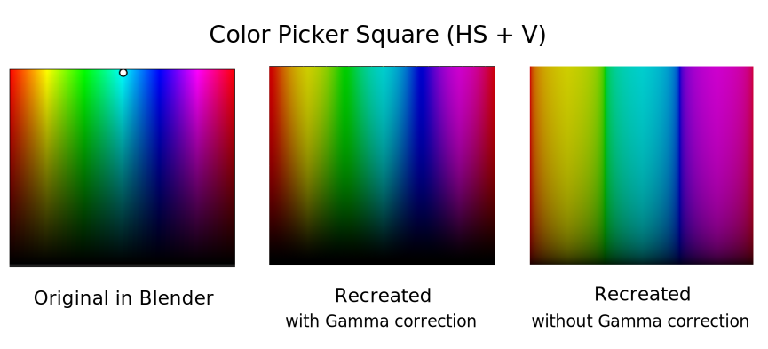

***********
Terminology
***********
The terminology about color is sometimes quite intimidating. Let's take a look at some basic concepts with the help of the well-known color picker. Did you know that Blender has five different :doc:`color pickers </interface/controls/templates/color_picker>` No? You can choose between them in the Preferences panel (Edit > Preferences > Interface). They look rather intuitive to use (see Figure 1) but already loaded with some difficult terminlogy. And even for this simple tool, several questions arise and trying to answer them will get you very fast into deep Blender space!

.. figure:: img/color_picker.svg
   :alt: The Color picker

   Figure 1: Color picker. The default option is shown at the left. The captions are taken from the Blender documentation.

1. Why do we need 5 of them? Is it only a matter of preference? Do they return different colors? Some color panels sure look brighter (1 vs 2 and 3 vs 4) than others. Why? In what aspect are they different?
2. How many different colors can you select? If the area of the little white dot is one color, then it seems that not many colors can be selected. Why are there two red's in the square panel (one at the left and one at the right) and not in the circle panel? Why are some color bands small (eg. yellow) compared to others (eg. green)?
3. Two panels use a circle and three a square shape to show all (?) the colors? Why? Also a matter of preference? And how do they relate? The color slider is sometimes placed horizontal and sometimes vertical? Any difference?
4. When you click on the Hex button, a little warning ('Gamma corrected') appear? What on earth does this mean? Should you be worried? Better not to use Hex? And why is it only shown underneath the Hex mode?
5. Besides, what is the meaning of all those abbreviations: RGB, HSV, HSL, Hex?  And why is HSL only mentioned once?
6. Dragging the value sliders (H, S, ...) from left to right reveal that they go from 0 to 1. But, for some of them, you can also enter values beyond 1 but not less than 0. Why?  And what do those values mean? ...

A lot of questions! Some look trivial and may be far fetched but searching for the answer will provide you with some profound insight into color management and also a few really ugly things. Let's focus on only one question in this post. How can you recreate these panels in Blender? Then, it will be apparent how they differ. That shouldn't be too difficult: a plane or circle with an appropriate material. Or so, you think!

Start Blender. Delete all objects, set the World Background color to black, switch to top view and add 2 circle and 3 plane meshes of 1 unit each. Position them next to each other; the exact location doesn't matter. To get the colors, you need a five materials. Switch to the Shading workspace and create the materials. You could name them according to the cryptic captions of figure 1.

.. note::
   You could download a `blend-file <files/terminology.blend>`_ with these materials already set-up.

Let's begin with the first square panel (square HV+S). The cryptic name suggests that the parameters H (Hue) and V (Value) are used to create the color panel and that the third parameter S (Saturation) is set by the separate horizontal slider. In the HSV-color model, you need all three values to define a unique color. From the sliders at the bottom you know that these parameters could vary between 0 and 1. Because your plane also has a width and height of 1 unit, the X and Y coordinates of each point in this plane will also vary between 0 and 1, but only if (0,0) is at the bottom-left of the square. Is there a shading node that can give you these coordinates?

Probably you should search in the Input group nodes (because this node should give you some input). It turns out that there are a quite a few nodes that could provide you with this info: the `Geometry node <https://docs.blender.org/manual/en/latest/render/shader_nodes/input/geometry.html>`_) and the `Texture Coordinate node <https://docs.blender.org/manual/en/dev/render/shader_nodes/input/texture_coordinate.html>`_. The geometry node has (in this case) the disadvantage that it outputs world space coordinates. Moving the object in 3D-space will thus this change these coordinates, which is undesirable. You need something in the range (0 - 1), no matter where the object is located in 3D space. The Texture Coordinate node is what you're looking for. This node outputs for each shading point (this is a point on a surface of our object that could be hit by a light ray) an output vector with the X, Y and Z coordinates of that shading point, e.g. (0.4, 0.3, 0). Moreover, if you choose for the generated texture coordinate, these coordinates have an origin of (0,0,0) at the left-bottom of the shape; again, exactly what you want.  With the `Separate XYZ node <https://docs.blender.org/manual/en/latest/render/shader_nodes/converter/combine_separate.html>`_ you can split this vector into the individual X, Y and Z coordinates.

Then, how do you make colors out of these numbers? Your first guess could be to use the Combine RGB node. This node accepts values for the 3 color channels and creates a mixed color from it. Unfortunately, you need three values for the full spectrum and our Z-coordinate is always zero because we paint the colors on a 2D- plane. This Combine RGB node could well work with a cube, which has three dimensions. Besides, the color panel isn't simply a kind of gradient of one color going from 0 to 1. The red color, for example, occurs both at the left and right side of the square. Upon closer look, the color panel resembles the Hue color card examples; see for example `Wikipedia <https://en.wikipedia.org/wiki/Hue>`_. Maybe you could use the `Hue/Saturation node <https://docs.blender.org/manual/en/dev/render/shader_nodes/color/hue_saturation.html>`_. Normally this node is used to change the hue, saturation or value of a color or image.

.. figure:: img/color_picker.png
   :alt: Shading nodes for recreating the color picker

   Figure 2: Shading nodes for recreating the (square HV+S) color panel of the color picker.

Note that we use the color cyan as input color. According to the documentation, the Hue parameter specifies the hue *rotation* of the image. 360° are mapped to (0 to 1). The hue shifts of 0 (-180°) and 1 (+180°) have the same result. So, the Cyan color which is at about 180° will be shifted -180° and therefore becomes zero or red at the texture coordinate 0 and again to red (cyan + 180° = 360°) at texture coordinate 1.

The panel is a combination of Hue and Value, with the Saturation parameter in a separate slider (Square HV + S). The Value parameter is represented by the Y axis, which runs from 1 (top) to 0 (bottom). So, you can use the Y socket to plug into the Value parameter of the Hue-Saturation-Value node.

Why do you need the Gamma node? Human vision is not linear. Doubling the light intensity will not necessarily double the perceived light intensity. We are much more sensitive in the dark regions than in the light regions. Slight increments of the light energy in the shadow regions will be much more noticeable than in the lighter regions. The Gamma node takes as input a color and applies a power function; eg. x^power to it. The exponent is called gamma.

   Figure 3: The original color picker (left), from node tree (above) with Gamma correction (center) and without Gamma correction (right).

The panel in the middle of figure 3 is with gamma encoding. The 'gamma' exponent is set to 2.2, which is defined in the sRGB color model. So, an input intensity of 0.25 is transformed to a output intensity of 0.25\ :sup:`2.2` = 0.047. The result is thus darker (closer to zero); which is very obvious if you compare the two right-most panels of figure 3. But the darkening occurs predominantly in the shadows and midtones.

.. csv-table:: Table 1: Gamma function
   :header: "x", "x\ :sup:`2.2`"
   :widths: 20, 20
   :align: center

   0.000, 	0.000
   0.250, 	0.047
   0.500, 	0.218
   0.750, 	0.531
   1.000, 	1.000

The material for the Square (HS + V) and the Square (SV + H) color picker is very similar as the one from fig. 2. You have to connect the X and Y coordinates from the plane with the HS or the SV parameters of the Hue Saturation Value node. In figure 1, a blueish color is selected. Search for the little white dot in the different color panels. It is known by the name "Iceberg blue" and has the following specifications, according to the `list of colors at Wikipedia <https://en.wikipedia.org/wiki/Lists_of_colors>`_. Note that we have selected this color also in the Hue-Saturation-Value node. See also Table 2.

.. csv-table:: Table 2: Hex, RGB, HSV and HSL specification of the color Iceberg Blue
   :header: "Hex", "Red", "Green", "Blue", "Hue (HSV/HSL)", "Saturation (HSL)", "Lightness (HSL)", "Saturation (HSV)", "Value (HSV)"
   :widths: 20, 20, 20, 20, 20, 20, 20, 20, 20
   :align: center

   "#71A6D2", "44%", "65%", "82%", "207°", "52%", "63%", "46%", "82%"

**Additive color mix**
You've certainly heard that colors are additive in the RGB color space. What does this mean? You can experience it yourself by recreating the additive color mix diagram in Blender.

The easiest solution is to create three spot lights. So, start Blender, delete the default cube and the light. Switch to top view; add three lights of type spotlight and a plane.

1. Switch to top view. This is not really essential but it makes your life much easier to get a spot light projection as a perfect circle.
2. Add three lights of type spot. Position them at location: Red (0, -0.25, 1), Green (-0.5, 0.5,1) and blue (0.5, 0.5, 1). Select the appropriate color and eventually Power (1000 W) and Spot Shape Size (75°).
3. Switch to render preview. Are the colored circles visible? NO, because there is no surface to 'shine' on.
4. Add a plane at location (0,0,0) with the appropriate size. The colored circles become visible.
5. You need also to position the camera at location (0,0, 10) and change the view to camera view (Alt+Ctrl+0). Then you can render the image.

.. figure:: img/additive_color_mix_3_spots_render.png
   :alt: Additive color mix

   Figure 3: Evee render of of the additive color mix of 3 spotlights.

Figure 3 shows a nice additive color mix diagram. Note, however the status bar with extra info concerning the red color (obtained by Right-clicking on the red circle in the render preview).
