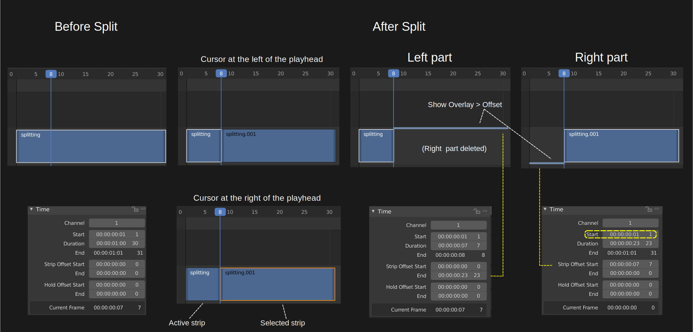
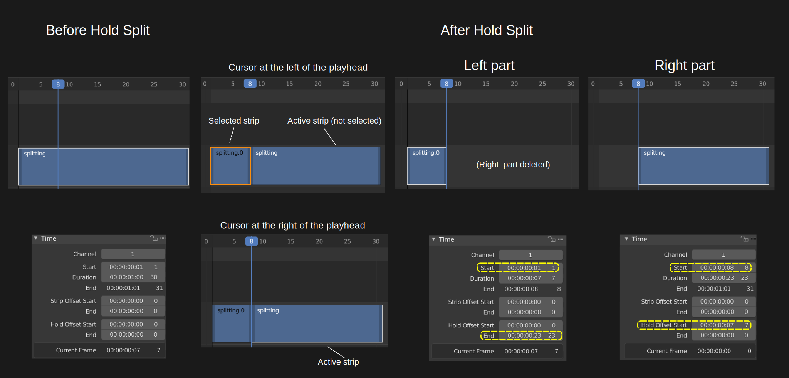
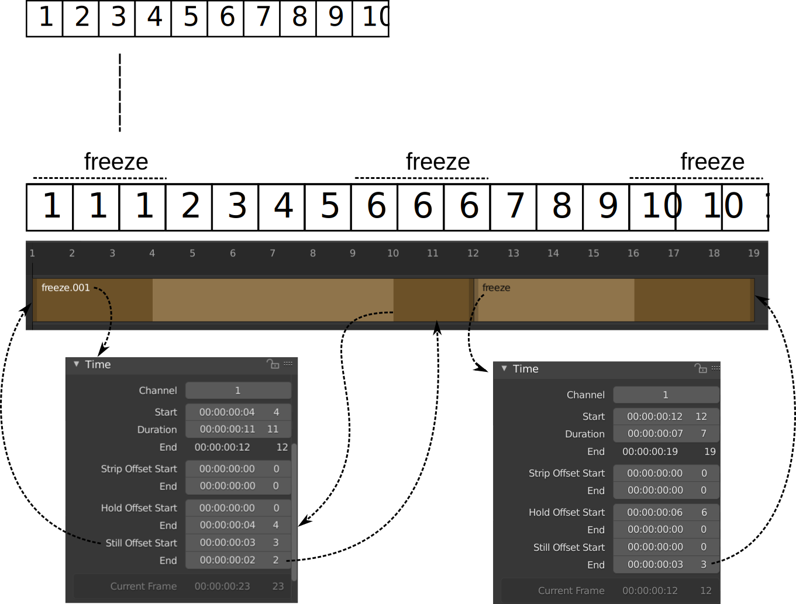

Splitting
---------
Splitting a strip is separating the strip into two parts at the position of the playhead. Both parts continue to function as independent strips (who shares the same source). Splitting can be done on all strip types. Splitting an effect strip however will also slit the input strip of the effect and vice versa.

In previous versions of Blender and also in a substantial part of the literature this operation was called "Cutting".  In a computer environment however this term is primarily used in the sense of copy-cut-paste, where it implicates delete. So, the term *Split* is preferred, although it stays very visible in terms such as *Jump Cut*, *J- or L-Cut*, ....

There are two variants of the command: Split and Hold Split.

Split command
.............

With the menu :menuselection:`Strip --> Split` or the shortcut key :kbd:`K` you can split the selected strip in two at the current frame. This will result in two strips which use the same source, fitting the original strip's timing and length.

.. warning::
   If you are using the shortcut :kbd:`K`, then it matters which side of the playhead the mouse cursor is (see figure 1). If the cursor is at the left hand side of the playhead, then the left strip is the active one (white outline & text overlay) and therefore also selected. If the mouse cursor is at the right of the playhead, then the right strip is the selected strip (orange outline)  *but* not the active one (no white text overlay). Contrary to what you might suspect, the Time fields then relate to the left strip; not the (selected) right strip. 

   
   Figure 1: Strip properties before and after Split command

Please note, that in figure 1 the result right after the Split command is issued, is shown in the second column. In the third column the right part of the Split is deleted. In the fourth column, the left part is deleted and the right strip is made the active one.

Also note that the Start frame of the left and right strip is the same: frame 1; even though the right strip starts visually at frame 8. This is accomplished with the Strip Offset Start field. And likewise, the premature ending of the left strip is done with the Strip Offset End field.

From either part of the split, you can restore the entire original strip. It suffices to reset the Strip Offset fields to zero. This can also be done by dragging the left or right handle.

Hold Split command
..................

The menu :menuselection:`Strip --> Hold Split` or the shortcut :kbd:`Shift-K` splits a strip in two distinct strips; however you will not be able to drag the handles to show the frames past the split of each resulting strip.

   
   Figure 2: Strip properties before and after Hold Split command

There are *subtle* differences between figure 1 and 2: the resulting strips are almost mirrored. Also, note that the first left part is renamed. For the Strip command, the most important part of the split operation seems to be the first (left) part. For the Hold Split command it is the second part.

The Start frame of the second (right) part and the End frame of the first (left) part are recalculated with the Hold Offset Start and Hold Offset End value. The name *Hold* indicates that the Start and End frame are fixed. The strip will start or end there and dragging the handles will not reveal any new frames.

As in the Split command, from either part of the Hold Split, you can restore the entire original strip. It suffices to reset the Hold Offset fields to zero. This *cannot* be done by dragging the left or right handle. The result of dragging is that the first or last frame is duplicated, inducing a Freeze Frame effect (see :ref:`(see Time panel of Movie strip <time-panel>` for more info).

Freeze frames
.............

Suppose that you have the following strip (see figure 3) and you want to introduce some freeze frames effect.

   
   Figure 3: Freeze frames example

The Freeze at the Start and End of the strip is easy. You only have to drag the handles to introduce a Still Offset (see :ref:`Time Panel > Still Offset <time-panel>` for more detailed information. The left panel of figure 3 has a still Offset Start of 3 frames and so has the Still Offset End field of the right panel.

The Freeze in the middle of the strip is more complicated. First, you need a Hold Split at frame 6 (playhead at 7) of the original strip. That way there is a Hold flag on frame 6 so that dragging the right handle will duplicate frame 6. You need this Hold flag on the left part of the split e.g. freeze.001. This is a Hold Offset End value of 4 because the original strip was 10 frames long.

The strip in figure 3 has a brown color because it is an image sequence. You can add the Still Offset fields to the Time panel with a little Python code (see :doc:`useful scripts </extra-tools/python/useful-scripts>` ).

