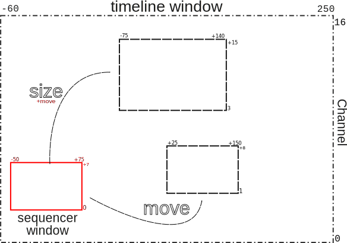

Move
----

Your timeline is a collection of all kinds of strips, spread in time and over multiple channels. With the :kbd:`Home` key, you can see your whole project, but most of the time you're zoomed in and only see a part of all the available strips. Then you need to move through your timeline.

.. |infinity| unicode:: 0x221E

Theoretically the Timeline window can span the frames from - |infinity| to + |infinity| and from channel 0 to channel + |infinity|. Of course, the Sequencer window only shows a small part of this possible timeline.  Two basic operations are possible with these two windows: move and size.

   Figure 1: Move & size of the Sequencer window

In figure 1, the Sequencer window occupies the area from frame -50 to +75 and the channels 0 - 7 of the timeline window. Within this timeline window you can move the Sequencer window to another area; e.g. (+25, +150, 1, 8). The surface area does not change. You can also size (and move) the Sequencer window and make it bigger (-75, +140, 3, 15).

.. Note::
   The Sequencer Timeline window is calculated as follows:
   
   - Horizontal: from Start to End.
   - Vertical: from channel 0 to 7.

   This range is *extended* by any strip outside this range. So, if you set your project End to 10 000, the horizontal scrollbar will be very small, even though you only have strips in the range of 0 -250.

To move the Sequencer window you can use a *shortcut key* or the *scrollbars*.

.. hint::
   If you don't have a 3 button mouse or a numpad (e.g. you are working with a tablet and stylus on a laptop), you can enable ``Emulate 3 Button Mouse`` and/or ``Emulate Numpad`` in the `User Preferences <https://docs.blender.org/manual/en/dev/editors/preferences/input.html>`_. You can use then the regular numeric keys. Pressing the :kbd:`MMB` is simulated by pressing the :kbd:`Alt` key (not :kbd:`Alt Gr`) and the :kbd:`LMB` (or pressing the stylus) together and drag. 

Numpad + zero
   Pressing the :kbd:`Numpad zero` will pan the Sequencer window, so that the playhead is at the center. You have to use the numpad, unless you have set ``Emulate Numpad`` in the User Preferences (see note above).

MMB + drag
   Pressing the :kbd:`MMB` and dragging left or right will pan the Sequencer window horizontally. Dragging up or down will move the window vertically. It is not that important where in the sequencer you click (center, top left, ...) because you can keep on dragging beyond the screen border. Of course, vertically, you cannot move further than channel 0, although it is possible to move beyond channel 32 (which is the highest channel you can put strips on).

Ctrl - MMB + roll
   Pressing the :kbd:`Ctrl MMB` and roll with the wheel will pan the Sequencer window horizontally. 

Shift - MMB + roll
   Pressing the :kbd:`Ctrl MMB` and roll with the wheel will pan the Sequencer window vertically. 

Scrollbars
   You can also use the horizontal or vertical scrollbars to move the timeline. Click at the scrollbar (not the circles) and drag. The horizontal scrollbar gives you an indication of how much and what area the Sequencer window occupies in the Timeline window.
   
Figure 2 shows a project with a span of 100 frames (Start=1; End= 100). Since there are no strips, the Timeline window runs from frame 1 to 100.

.. figure:: img/scrollbar.svg
   :alt: scrollbars

   Figure 2: Horizontal scrollbar in Sequencer

Because the sequencer window only covers frames 30 - 50, there will be 30% of the Timeline window hidden from the start and only 20% (frames 30 - 50) will be visible. The scrollbar hints to this: the visible area (between the circles) covers 4 frames (=20% of 20 frames) and the scrollbar starts at frame 36, which is 6 frames or 30% from the start. Please note that the project span is calculated from the Start and End frame, unless there are strips beyond these boundaries. In that case, the project span runs from the start frame of the first strip until the End frame of the last strip.

For the vertical scrollbar, the project span is - without any strips - from channel 0 to channel 7. If there are strips above channel 7, then the project span is from channel 0 until that channel.

