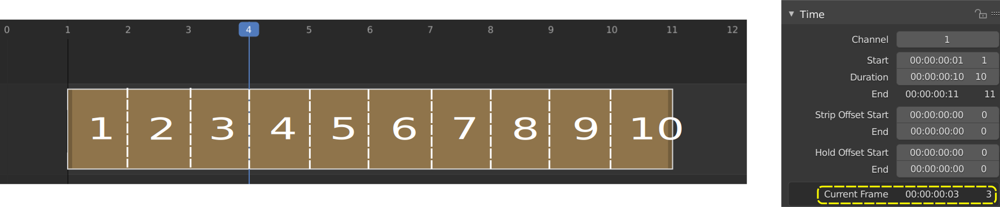

Navigate
--------
Navigating in your timeline is done by moving the playhead, so that you can see the selected frame in the preview window. The playhead is the blue vertical line with the previewed frame number at the top.

   Figure 1: Playhead details

In figure 1, the playhead is positioned between frame 3 & 4 and indicates with the little blue square at the top that frame 4 is in the Preview window. So, the playhead is always positioned at the start of the previewed frame.

.. |notequal| unicode:: 0x2260

.. Warning::
   There could be some confusing regarding the term Current Frame. According to the Strip properties > Time panel, the Current Frame is frame 3, although the playhead and the Preview window show frame 4. This is because the Current Frame field in the Time panel is a relative measure: it is the position of the Playhead relative to the visual start (|notequal| the Start field) of the active strip.
   
   - In figure 1: playhead is at frame 4; the strip starts at frame 1; Current frame = 3; you have to move 3 frames from the playhead to get at the visual start frame.
   - If the strip should start at frame 0, then the Current frame should be 4.
   - If the strip starts at frame 5 and the playhead is at frame 8, then the Current Frame = 3.

Jumping to a specific frame
   The Playhead can be set or moved to a new position by pressing or dragging with the  :kbd:`LMB` in the scrubbing area at the top of the timeline. This is the area with the frame numbers or time codes.

   This can also be done by pressing or dragging with the  :kbd:`Shift RMB` in the scrubbing area of the sequencer. The scrubbing area of the sequencer is the entire area, including the existing strip bars.

   The playhead can be set to a specific frame by entering the frame number in the Current Frame field of the Timeline Editor; usually at the very bottom right hand side.

Moving frame by frame
   The Playhead can be moved in single-frame increments by pressing the cursor keys :kbd:`Left` or :kbd:`Right`.

   Rolling with the :kbd:`MMB` while holding :kbd:`Alt` (:kbd:`Alt-Wheel`) will also move the playhead frame by frame.

Jump to boundaries
   You can jump to the Frame Start or Frame End of the project by pressing :kbd:`Shift-Left` or :kbd:`Shift-Right`. These two fields are set in the Properties Editor > Dimensions panel or in the Timeline Editor (bottom right).
   
   The same could be done by clicking the Jump to Endpoint transport controls in the Timeline Editor

   Pressing :kbd:`PgUp` or :kbd:`PgDn` will move the playhead to the start of the next or previous strip (over all channels). The same could be obtained by holding :kbd:`Ctrl` *after* you have started dragging with the :kbd:`LMB` in the scrubbing area of the timeline.

   Pressing :kbd:`Alt PgUp` or :kbd:`Alt PgDn` will move the playhead to the *center* of the next or previous strip (over all channels).

Scrubbing
   Dragging with the :kbd:`LMB` in the scrubbing area at the top of the timeline or with the :kbd:`Shift RMB` in the scrubbing area of the sequencer is often called scrubbing.
   
   When you drag with :kbd:`Shift-RMB` directly on a sequence strip, this will show the strip *solo*, (temporarily disregarding effects and other strips, showing only this strip's output). For example, if you have two color strips on top of each other, normally you see the strip from the highest channel in the Preview window. Drag with :kbd:`Shift-RMB` on the lower color strip will show this color strip in the Preview window.

Playing
   Pressing the Play Animation transport controls in the Timeline Editor will start the play from the playhead in forward or reversed direction. Pressing the Pauze transport control will stop the playing.

   Start or stop playing could also be initiated with the :kbd:`Spacebar`.

.. hint::

   Every other synced editor can be used for scrubbing e.g. the Timeline.
