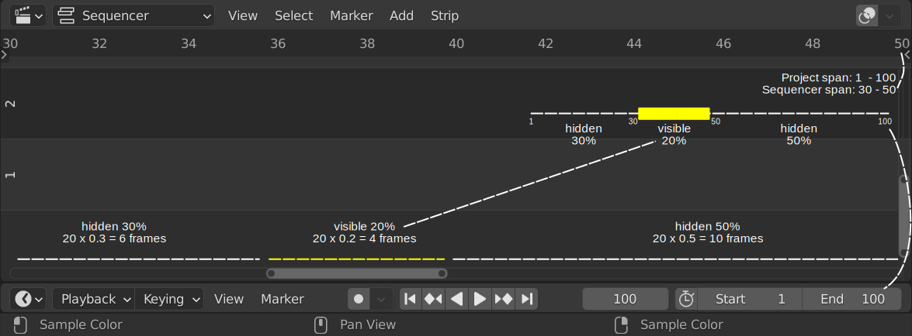

Navigate
--------

Your timeline is a collection of all kinds of strips, spread in time and over multiple channels. With the :kbd:`Home`key, you can see your whole project, but most of the time you're zoomed in and only see a part of all the available strips. Then you need to navigate through your timeline.

Moving the timeline (canvas)
............................

You can use two methods: a shortcut key or the scrollbars.

Pressing the :kbd:`MMB` and dragging left or right will pan the timeline horizontally. Dragging up or down will move the timeline vertically. It is not that important where in the sequencer you click (center, top left, ...) because you can keep on dragging beyond the screen border. Of course, vertically, you cannot move further than channel 0, although it is possible to move beyond channel 32 (which is the highest channel you can put strips on).

.. note::
   If you don't have a 3 button mouse or if you are working with a tablet and stylus, you can enable ``Emulate 3 Button Mouse`` in the `User Preferences <https://docs.blender.org/manual/en/dev/editors/preferences/input.html>`_. For panning then, you have to press the :kbd:`Alt` key (not :kbd:`Alt Gr`) and the :kbd:`LMB` together and drag. 

You can also use the horizontal or vertical scrollbars to move the timeline. Click at the scrollbar (not the circles) and drag.The horizontal scrollbar gives you an indication of how much and what area of the project is visible in the Sequencer's timeline. Figure 1 shows a project with a span of 100 frames (Start=1; End= 100).

   Figure 1: Horizontal scrollbar in Sequencer

Because the sequencer window only covers frames 30 - 50, there will be 30% of the project hidden from the start and only 20% (frames 30 - 50) will be visible. The scrollbar hints to this: the visible area (between the circles) covers 4 frames (=20% of 20 frames) and the scrollbar starts at frame 36, which is 6 frames or 30% from the start. Please note that the project span is calculated from the Start and End frame, unless there are strips beyond these boundaries. In that case, the project span runs from the start frame of the first strip until the End frame of the last strip.

For the vertical scrollbar, the project span is - without any strips - from channel 0 to channel 7. If there are strips above channel 7, then the project span is from channel 0 until that channel.

Scaling the timeline
...................

Pressing the :kbd:`Ctrl MMB` and dragging left will enlarge the sequencer timeline. For example, if you are looking at a timeline (frame 30 -100), dragging left will show you a bigger timeline, e.g. frame 20 - 120. Dragging right will make the timeline smaller. The change is equal to left and right.

Dragging the circles on the scrollbar lets you also reduce or enlarge the timeline. You can now choose however which side of the timeline you want to change. Dragging the left circle will change the starting frame of the timeline. Dragging the right circle will change the ending frame of the timeline.

The same reasoning holds for the vertical scrollbar circles.

.. warning::
   The messages in the statusbar are not very helpful, nor correct. For example :kbd:`Ctrl MMB` shows the status message of "Zoom 2D view" which seems not to be correct. The other modifier keys are not mentioned.

- Pan: :kbd:`MMB`
- Zoom: :kbd:`Wheel`
- Vertical Scroll: use :kbd:`Shift-Wheel`, or drag on the left scrollbar.
- Horizontal Scroll: use :kbd:`Ctrl-Wheel`, or drag on the lower scrollbar.
- Scale View: :kbd:`Ctrl-MMB` and drag up/down (vertical scale) or left/right (horizontal scale).
- Scale View Vertically: drag on the circles on the vertical scrollbar.
- 