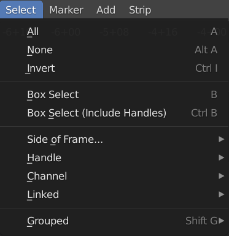

Select
------
Before you can do *anything* with strips, you have to select them. Please, note that there is a difference between a selected strip and the active strip (see figure 1). Selected strips have an orange outline, the active strip has a white outline. There can be only one active strip and the active strip is also a selected strip.

.. figure:: img/active-vs-selected.svg
   :alt: Active vs selected View

   Figure 1: Active strip versus selected strips

Select one strip
................

As can be seen in figure 1, a strip bar has a 'body' and a left and right handle; the small darker colored bars at the left and right of the strip. You can select the strip in its entirety (body + handles) by clicking :kbd:`LMB` somewhere in the middle of the strip bar. Dragging with the mouse will then *move* the strip to another position.

However, you can also click (nearby) the handles. This will select the handle. The darker colored small bar will become white and dragging will *extend* or *shorten* the clip (see section about :ref:`Offsets <time-panel>` to understand what is happening.

If you have :doc:`zoomed out <../zoom/zoom>` the strip bars could become pretty small and it's common to select the handles instead of the entire strip.

Select multiple strips
......................

Select random strips
    You can :kbd:`Shift` + click consecutively on strips to select them all. The strip that is last clicked will become the active one. If you want another strip to be active, click that strip again (without releasing :kbd:`Shift`). To deselect a strip, make it active and :kbd:`Shift` + click again.

   Figure 2: Select menu

Select All strips
   The shortcut key :kbd:`A` selects all the strips in the timeline (visible and invisible). The strip which was the last active strip becomes active again. The menu equivalent is Select > All (see figure 2).

Deselect All strips
   You can either choose :kbd:`Alt-A` of fast tap twice :kbd:`A` to deselect all the strips in the timeline. The menu equivalent is Select > None (see figure 2).

Invert selection
   Press :kbd:`Ctrl-I` to invert the current selection of strips. The menu equivalent is Select > Invert (see figure 2).

Box Selecting strips
   Pressing the :kbd:`B` key will produce a crosshair cursor. You can draw a rectangle selection around a region of strips in your Sequencer window.  All strips that intersect this rectangle (they should not be enclosed) will be selected.

Attribute based selection
.........................

Select all strips at left or right
   Pressing :kbd:`[` key will select all strips that start after the playhead in all channels. Pressing :kbd:`]` will select all strips that start before the playhead. Please note, that strips running over the playhead will not be selected. If you want those strips in the selection, you first have to select the opposite side and then invert that selection.

   Users of a non-QWERTY keyboard should use probably different keys. For example, on an AZERTY keyboard, you should use the ellipsis ) for the Select left command. You can change the key assignment rather easily in the User Preferences: menu Edit > Preferences > Keymap. Search for "Select Side of frame" and assign a new key.

Handle
   Operators to select strip handles.
   These operators are useful to change the timing of a cut by moving the handles after selecting them.

   Both, Left, Right
      Select the left, right, or both handles of selected strips.
   Both/Left/Right Neighbor
      Select the handle of the neighboring strip to the left, right, or on both sides of the selected strips.

.. _bpy.ops.sequencer.select_side:

Channel
   Select strips in the same channel laying left or right to active strip.

.. _bpy.ops.sequencer.select_more:
.. _bpy.ops.sequencer.select_less:
.. _bpy.ops.sequencer.select_linked:

Linked
   All :kbd:`Ctrl-L` / Less :kbd:`Ctrl-NumpadMinus` / More :kbd:`Ctrl-NumpadPlus`
      Selects strips, that are placed next to each other without any gaps.

.. _bpy.ops.sequencer.select_grouped:

Grouped :kbd:`Shift-G`
   Selects strips according to their relation with other strips.

   Type
      Selects any strips of the same type within a category for example,
      if you have a cross strip selected this will select all other effect strips.
   Global Type
      Selects any strips of the same type, e.g. Effect, Image, Movie, etc.
   Effect Type
      Selects all effect strips.
   Data
      Selects strips that share the same data, for example, two image strips sharing the same image file.
   Effect
      Selects the strip that shares an effect strip.
   Effect/Linked
      Selects the effect strips, if any, linked to the currently selected strip.
   Overlap
      Selects any strips that occur on the same frame as the current.

      
Box Select (Include Handles) :kbd:`Ctrl-B`
   Works the same as *Box Select* but it selects only the strip's handles,
   if just one handle is selected moving the strip after selecting will change the strip's length.
   If both handles are selected the strip will move and behave the exact same as *Box Select*.

.. _bpy.ops.sequencer.select_side_of_frame:

