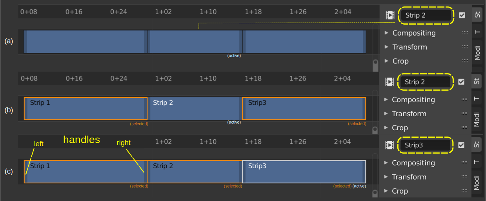
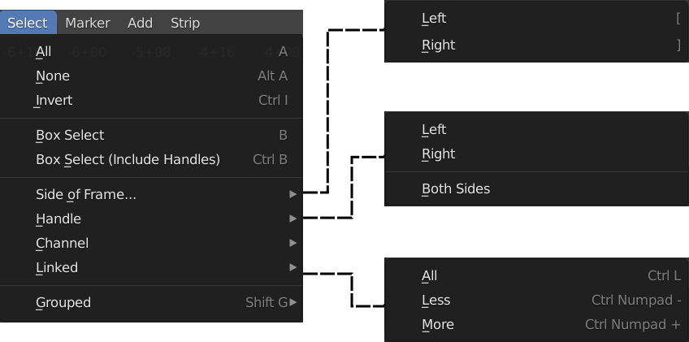

Select
------
Before you can do *anything* with strips, you have to select them (see below for the different methods of selecting). There is a difference between a selected strip and the active strip (see figure 1). Selected strips have an orange outline, the active and selected strip has a white outline, and white text if available. There is always one and only one strip active. The properties shown in the sidebar belong to this active strip.

   Figure 1: Active strip versus selected strips

Even if *no* strip is selected, there is an Active strip. For example, in figure 1-a, the second strip is the Active strip. If there is no Text overlay or selection, the only way to know this is by looking at the sidebar. In figure 1-b, it is obvious that Strip 2 is active (white text) and that *only* strip 1 and 3 are selected (orange outline). In figure 1-c, all three strips are selected (orange and white outline) and strip 3 is the active one (white text).

Some actions such as Delete will apply only to the selected strips. Pressing Delete in figure 1-b will only delete strip 1 and strip 3. Other actions will only have an effect on the active strip such as scaling or rotating.

.. Note::
   Changing a value in the sidebar will normally only change the property of the active strip, even if more strips are selected. It is possible to apply an effect to all selected strips instead of only on the active one by pressing the :kbd:`Alt` key. You have to enter the value numerically and then pressing :kbd:`Alt` + :kbd:`Enter` will apply the value to all selected strips. If you change the value by dragging the slider, you have to press :kbd:`Alt` + :kbd:`Enter` twice  to apply the effect to all selected strips. You can also Right Click on any value and choose "Copy to Selected".

Select one strip
................

As can be seen in figure 1, a strip bar has a 'body' and a left and right handle; the small darker colored bars at the left and right of the strip. You can select the strip in its entirety (body + handles) by clicking :kbd:`LMB` somewhere in the middle of the strip bar. Dragging with the mouse will then *move* the strip to another position.

However, you can also click (nearby) the handles. This will select the handle. The darker colored small bar will become white and dragging will *extend* or *shorten* the clip (see section about :ref:`Offsets <time-panel>` to understand what is happening. Note that also the Start and/or End date is displayed; even if The Show Overlay button is disabled.

If you have :doc:`zoomed out <../zoom/zoom>` the strip bars could become pretty small and it's a known annoyance to select the handles instead of the entire strip. Once the handles are selected, you have to deselect (clicking in the middle part again won't help) and select the strip a second time to have access to the entire strip.

Select multiple strips
......................

Select specific strips
    You can :kbd:`Shift` + click consecutively on strips to select them all. The strip that is last clicked will become the active one. If you want another strip to be active, click that strip again (without releasing :kbd:`Shift`). To remove a strip from the collection, make it active and :kbd:`Shift` + click again.

   Figure 2: Select menu

Select All strips
   The shortcut key :kbd:`A` selects all the strips in the timeline (visible and invisible). The strip which was the last active strip becomes active again. The menu equivalent is Select > All (see figure 2).

Deselect All strips
   You can either choose :kbd:`Alt-A` or fast tap twice :kbd:`A` to deselect all the strips in the timeline. Or, and this is probably the most used technique: just click somewhere outside the strips in the sequencer. The menu equivalent is Select > None (see figure 2).

Invert selection
   Press :kbd:`Ctrl-I` to invert the current selection of strips. The menu equivalent is Select > Invert (see figure 2).

Box Selecting strips
   Pressing the :kbd:`B` key will produce a crosshair cursor. You can draw a rectangle selection around a region of strips in your Sequencer window.  All strips that intersect this rectangle (they should not be enclosed) will be selected. The menu equivalent is Select > Box Select (see figure 2).

   The same result could be obtained by just :kbd:`LMB` clicking and dragging the selection over some strips.

Extend/shrink selection
   

Location based selection
.........................

   Figure 2: Select Location Based

With these commands you can select strips, based on their position on the timeline in relation to the playhead or the active strip (see figure 2).

Select all strips based on position of playhead 
   Pressing :kbd:`[` key will select all strips that *start after* the playhead in all channels. Pressing :kbd:`]` will select all strips that *start before* the playhead. Please note, that strips running over the playhead will not be selected. If you want those strips in the selection, you first have to select the opposite side and then invert that selection (see above).

   Users of a non-QWERTY keyboard probably need different keys. For example, on an AZERTY keyboard, you should use the ellipsis ) for the Select left command. You can change the key assignment rather easily in the User Preferences: menu Edit > Preferences > Keymap. Search for "Select Side of frame" and assign a new key.

   You can also use :kbd:`Ctrl + LMB` at the *left* of the playhead to select all strips before the playhead or :kbd:`Ctrl + LMB` at the *right* of the playhead to select all strips after the playhead.

   To select all strips located at the position of the playhead, choose the submenu  *Current Frame*. There is no shortcut key associated by default.

   The menu equivalent is Select > Side of Frame (see figure 2), with options: Left, Right or Current Frame.

Select strips in channel
   Select strips in the same channel laying left and/or right of the selected strips.
   The menu equivalent is Select > Channel (see figure 2), with options: Left, Right or Both Sides. The difference with the previous command is that the selection is taken as reference; not the playhead.

   Use this command to select all strips in the channel of the active strip by choosing the both sides option.

Select Linked strips
   :kbd:`Ctrl + L` will select all the strips in the same channel that are connected with the Active Strip, meaning there are no gaps between them.

   The menu equivalent is: Select > Linked > All.

   .. Todo::
      The menu Select > Linked > Less and More seem to be doing nothing.

Select Linked strips Vertically
   The shortcut key :kbd:`LMB` + Click on a strip will select all above and below it, if the have exactly the same Start and End time. The clicked strip becomes selected and active. This shortcut is not exposed in the menu.

Attribute based selection
.........................

.. figure:: img/select-menu-attribute-based.svg
   :alt: Select Attribute Based

   Figure 3: Select Attribute Based

With these commands you can select strips according to their relation with other strips and their strip type. First select a strip and press  :kbd:`Shift-G` or use the menu Select > Grouped (see figure 3).

Type
   Selects all strips of the same type as the active strip within a category. For example, if you have a speed control strip selected, this command will select all other speed control strips but not the Transform or Cross Transition strips.
Global Type
   With this command you can differentiate between Audio strips and the rest (Movie, Image, Effect, ...). To select all audio strips, make sure that the Active Strip is an audio strip and issue this command.

Effect Type
   Selects *all* effect strips. Please note that Text and Color strips are also considered as Effect strips.
Data
   Selects strips that share the same data, for example, two image strips sharing the same image file. This could be handy if you have used the same file on different places; e.g. a logo image.
Effect
   Selects all strips that have the same effect applied as the Active Strip. For example, if the Active Strip has a Blur effect, this command will select all other strips with a Blur effect.

Effect/Linked
   Selects other strips affected by the active one (sharing some time and below or effect-assigned.

   Select all strips within time range and with lower channel of initial selection. Then select effect chains of these strips. 

   .. Todo::
      Explain in more detail.
Overlap
   Selects any strips that occur on the same frame as the current. Note that the current frame is always in reference to the Start frame of the active strip. It does not correspondent with the playhead position.

Select strip handles
....................

.. figure:: img/select-menu-handles.svg
   :alt: Select Handles

   Figure 4: Select Handles

The strip handles are the small darker colored bars at the left and right of the strip. You can use them to create :ref:`Offsets <time-panel>` for the strip. You can select the handles-only with several commands (see figure 4).

.. Note::
   The visualization of the strip handles have been `discussed <https://developer.blender.org/D7401>`_ and reworked already a few times but they still do not look as polished as in some other editors. On HDPI monitors they are quite small and do not scale in relation with the zoom level. The cursor also don't give any clue if it is above the handle or the strip body.

:kbd:`LMB` + Click
   Just like selecting a strip, clicking with the :kbd:`LMB` in the 'neighborhood' of a handle will select this handle. The handle becomes white. Holding down :kbd:`Shift` will select multiple handles.

   If just one handle is selected, moving the strip after selecting will change the strip's length. If both handles (left and right) are selected the strip will move and behave as if the entire strip was selected with the regular Box Select.

:kbd:`Alt` - :kbd:`LMB`
   Using the Alt-key in combination with left click above a strip will select the strip handles of the strip *and* its neighbors. This is handy shortcut to trim the neighbor strips.

Box Select (Include Handles) :kbd:`Ctrl-B`
   Works the same as *Box Select* (see above) but it selects only the strip's handles that fall within the region.

   But, with this Box select, it is also possible to select the right handle of a strip and the left handle of its successor. Moving this selection (with :kbd:`G` or :kbd:`LMB`) will trim the left strip, if moving left or the right strip, if moving right. We cover these techniques in more detail in section: Edit > Assembling > Cutting.

Handle
   This command operates on the Active strip. You could choose between Both, Left or Right. This will select the appropriate handles of the active strip itself. Or you can choose Both, Left or Right Neighbor. This will select the handles of the active strip and the appropriate handles of the neighbor strip.

   These operators are useful to change the timing of a cut by moving the handles after selecting them.
