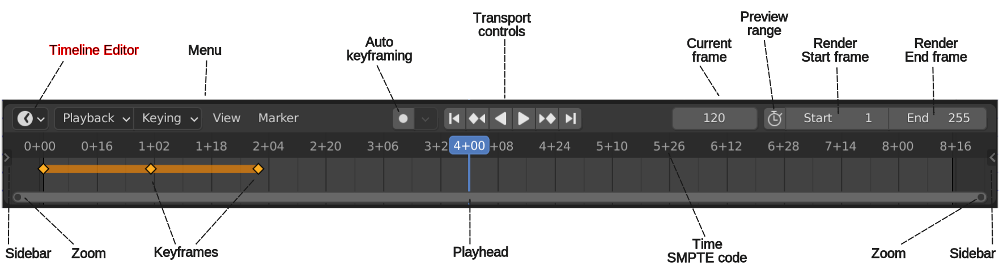

Timeline basics
===============

.. toctree::
    :maxdepth: 3
  
    move/move
    zoom/zoom
    select/select
    navigate/navigate
  
The concept *Timeline* can refer to different things. In Blender, it denotes in the first place the `Timeline Editor <https://docs.blender.org/manual/en/dev/editors/timeline.html>`_ , identified by a clock icon and used for manipulating keyframes and scrubbing the playhead. This Timeline Editor was originally intended for editing the animations in 3D modeling.

   Figure 1: The Timeline Editor in Blender

You can find this Timeline Editor also in the :doc:`Video Sequence Editor workspace </setup/customize/workspace/video-editing-workspace>`, all the way at the bottom of the screen. Only the header is visible; so you have to drag the horizontal top border to reveal the time codes and keyframes.

The use of *this* Timeline Editor within the Video Editor workspace is rather *limited* and a case could be made to remove it from the Video Editing workspace. Its functions can easily be overtaken by the Sequencer (see figure 2), which is right on top of it.

The Sequencer has indeed also a kind of timeline on its own. Practically all the regular operations like zoom, move, ... can be done here. Only the Frame and Transport controls are missing. These can however easily be added to the workspace (see the addon by TintwoTin; `Playback_control_in_VSE_header.zip <https://github.com/tin2tin/Sequence_Editing>`_ ). 

.. figure:: timeline-sequencer.svg
   :alt: Sequencer timeline

   Figure 2: The timeline of the Sequencer Video Editor in Blender

As you can see from figure 2, the timeline codes are displayed in so-called SMPTE timecodes. A SMPTE timecode is a standard format, adopted by the Society of Motion Picture and Television Engineers (SMPTE) in the late 1960s. It is written as HH:MM:SS:FF, e.g. 00:01:12:06. This means the time after 1 minute, 12 seconds, and 6 frames. If your project has a framerate of 24 fps, the 6 frames will add another 0.25 seconds to the timecode.

You can change the timecode style. It's rather well hidden in User Preferences > Animation > Timeline.

.. figure:: timecode-style.png
   :alt: Timecode style

   Figure 3: The Timecode Style in User Preferences

.. csv-table:: Table 1: Timecode style
   :header: "Type", "Style", "Comment"
   :widths: 35, 10,350

   Minimal info, 1+18, 1 second and 18 frames
   SMPTE (Full), 00:00:01:18,
   SMPTE (Compact), 00:01:18,
   Compact with Milliseconds, 00:01:6, with fps = 30
   Only Seconds, 1.6,

In Blender, you can choose to show the timeline in *seconds* or in *frames*. Use the command :kbd:`Ctrl + T` or the menu View > Show seconds. In figure 4, the timeline is shown in frames. As a video editor, you probably are most interested in the time. It seems more natural to refer to a video fragment with a time indication, e.g. 00:01:15:10 or 1' 15'' and 10 frames than with a frame number, e.g. frame 55.

You cannot enter the SMPTE timecode directly in the side panel, you have to enter the frame number. The conversion from frame to SMPTE code is done by a Python function *smpte_from_frame*. This function takes one parameter (the frame number) and converts it to a timecode.

Because each project has a frame-per-seconds `fps` parameter, you can always derive one code from the other. In a 30 fps project:

* frame 155 is at time 115/30 = 3.8333 seconds or in SMPTE (Compact) notation: 00:03+25.
* time 2.5s falls somewhere within frame  2.5 * 30 = 75.

Blender keeps track of several time fields. Some - but not all - are exposed in the sidebar under the Strip > Time panel (see figure 1).

.. figure:: time_code.svg
   :alt: Time properties

   Figure 4: Time properties of a Movie strip.

With these time fields, Blender can calculate and draw the strip bars in the Preview section of the Sequencer.  The most important ones are of course *Start* and *Duration*. The *Start* field marks the position (frame number) from which all further calculations are done. The *Duration* is the number of frames of this strip.

.. warning::
    The *Start* field is NOT the same as the actual start of a strip; the position that you see in the Preview. It is the original start position of a strip that is not trimmed or cut. If you've added a strip at frame 5 and later on you trimmed that strip with a Start offset of +7 frames, then the visible strip will start at frame 12 but the *Start* field still says frame 5 (see figure 1).

    The *Duration* field however shows the actual duration. If a strip is trimmed or cut, this field will not show the original *Duration* but the Duration as you can see in the Preview.

With the *Start* and the *Duration* the *End* field can be calculated.  This is what Blender insinuates by making this field non-editable. However, there is no reason for that, and changing this field could for example result in the recalculation of the *Duration*.

In figure 1, the original strip has a *Duration* of 30 frames. It starts as frame 5; so the *end* should be at frame 35. Because there is some trimming, the actual start is at frame 12: *Start* + *Strip Offset Start*. The actual end is at frame 27: *(Original) End* - *Strip Offset End*. The (actual) *Duration* is thus 15 frames: *(Actual) End - (Actual) Start*. The Offset values could be made visible in the Preview as small blue bars with the Show Overlays button (top right in figure 1).

.. note::
   The naming of the fields in the previous paragraph is not quite accurate. There isn't any field with the name *Actual Start*. On the other hand, Blender's naming system also isn't very logical. You can look up the name of every Python generated field by enabling Developer Extras, User Tooltips and Python Tooltips in the Blender Preferences > Interface > Display. Hovering over the field in the UI. For example, the *Start* field is called  *frame_start* and the *End* field is called *frame_final_end*.

The Hold Offset fields are used to store the position of a Hold Split (shortcut Shift + K). Suppose we have a test strip, starting at frame 1 with a duration of 300 frames. When you make a Hold Split at frame 100, the following fields are filled in.

For the first part: the Start remains at frame 1 with a duration of 99 and an End frame = 100. The Hold Offset End field is set to 201, indicating that the Hold Split has occurred at Frame 100 (frame 301 (original End) - 201 (Hold Offset End)).

For the second part: the Start frame becomes 100 and the duration 201, so that the End frame is equal to the original End. The Hold Offset Start is set to 99, indicating that the Hold Split occurred at 100 from the original strip (frame 1 (original Start) + 99 (Hold Offset Start)). 

There are 12 timecode fields in Blender. They are discussed in more detail in the section :doc:`Strip types > Movie strips </setup/organize/strip-types/movie>`.

.. Warning::
   Don't make the mistake to think that timecode is equal to time. For a modern video file, all the time information, you get is the timestamp at the start of the recording and the duration in frames of the video. In more expensive systems a timecode could be embedded but normally isn't. So, the time codes are calculated by the software. And there it could go wrong.
   
   If your project has a project framerate of 30 fps and your imported footage is shot with a framerate of 24 fps, the timecode that you see will always refer to the project. So, the code 00:00:02:6 will refer to frame 36 which is at 2.2 seconds from the start. However, this 36th frame was at 2.5 seconds from the start in the raw footage. If there was an explosion at that moment in time, the sound of it will occur later in your project and will be associated with the wrong frame image. 

