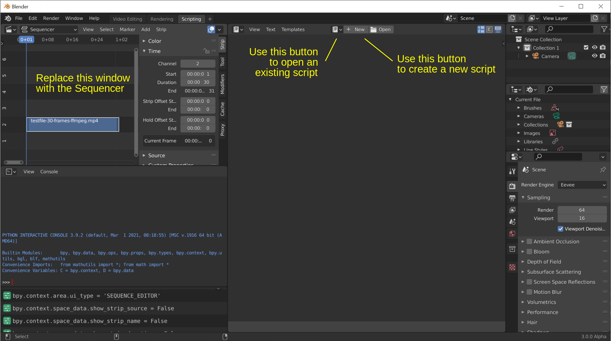
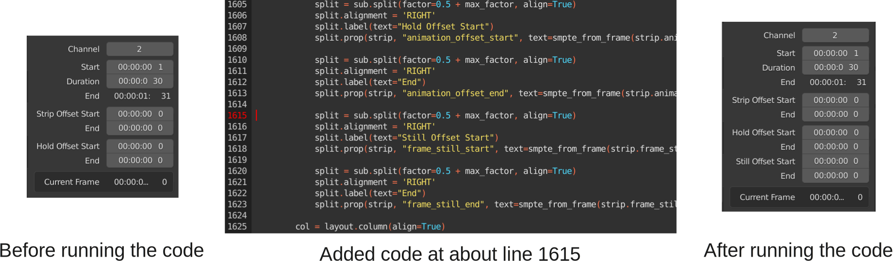

**************
Useful scripts
**************
The following scripts could best be tested in an adapted workspace. (1) From an existing video editing project, switch to the Scripting Workspace (eventually, click on the Add Workspace button in the menu bar) (2) Replace the 3D Editor window (top left) with the Video Sequencer. (3) Select an appropriate object (e.g. movie strip) in the sequencer ( See figure 1). Working within this workspace is explained in :doc:`<scripting-workspace>`.

   Figure 1: Adapted scripting workspace for VSE scripts

Adding still_offset fields
==========================

Blender exposes 9 time codes in the UI (see :doc:`Movie strip  </setup/organize/strip-types/movie>`). There are more available through the Python API. Table 1 shows all the available time codes. The second column is the name from the sidebar (UI) and the third column is the name from the Python API.

.. csv-table:: Table 1: Time code fields in UI and from Python API
   :header: "#", "UI field", "Python API (1)"
   :widths: 5, 50,50
 
   0 , Channel (2)           , channel
   1 , Start                 , frame_start          
   2 , *Visible in strip (3)* , frame_final_start
   3 , Duration              , frame_final_duration 
   4 ,                       , frame_duration  
   5 , End                   , frame_final_end      
   6 , Strip Offset Start    , frame_offset_start   
   7 , Strip Offset End      , frame_offset_end     
   8 , Hold Offset Start     , animation_offset_start
   9 , Hold Offset End       , animation_offset_end 
   10, Current Frame         , *calculated (4)*   
   11,                       , frame_still_start    
   12,                       , frame_still_end      

If you want to see those values in the side panel, you'll have to extend the existing code; It's rather easy. Select a movie strip and right-click on a timecode field, e.g. Hold Offset Start and choose "Edit Source". The "space_sequencer.py" code will become visible (op open with the Browse Text to be linked button at the top middle). Search in this code (Ctrl + F) for the string "Hold Offset Start". It is about line 1607 (Blender 3.0). Add the following code after the Hold Offset section (about line 1615).

.. code-block:: Python

   split = sub.split(factor=0.5 + max_factor, align=True)
   split.alignment = 'RIGHT'
   split.label(text="Still Offset Start")
   split.prop(strip, "frame_still_start", text=smpte_from_frame(strip.frame_still_start))

   split = sub.split(factor=0.5 + max_factor, align=True)
   split.alignment = 'RIGHT'
   split.label(text="End")
   split.prop(strip, "frame_still_end", text=smpte_from_frame(strip.frame_still_end))

Run the code Alt + P). The sidebar will be changed. See figure 2. Note that this code will not run automatically when you open the file again. If you want the changes to be persistent, you should convert the space_sequencer.py code into an add-on.

   Figure 2: The result of running the above script.

