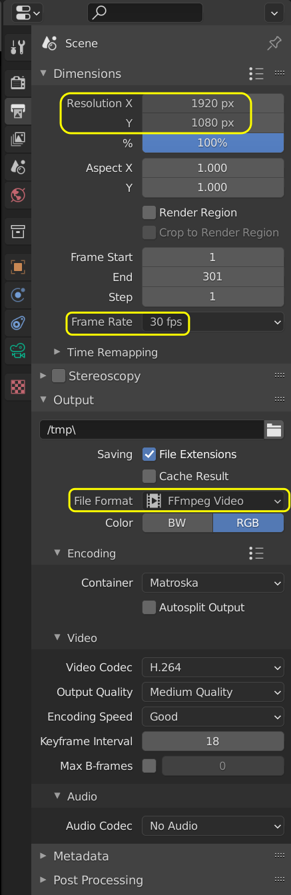
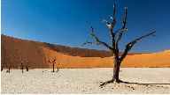

Project settings
----------------

   Figure 1: Project Settings

The Project Settings for your video project are grouped in the `Output Properties <https://docs.blender.org/manual/en/dev/render/output/index.html>`_ tab of the Properties Editor. This editor is located at the top right area in the default Video Editing workspace and is shared with the other modules, e.g. 3D modeling. The most important settings for video editing are:

* Dimensions panel
  
  * Resolution X, Y: The number of pixels horizontally and vertically in the image.
  * Frame Rate: How many frames will be displayed per second.

* Output panel

  * File path: The location to save rendered frames.
  * Format: Based on which format is used, other options such as channels, bit depth and compression level are available.

Resolution
..........

The resolution X and Y refer to the number of pixels in the horizontal and vertical axis of the output video. Common video resolutions are:

- High Definition (HD) or 720p (1280 x 720)
- Full HD or 1080p (1920 x 1080)
- Ultra HD (UHD) 4K or 2160p (3840 x 2160).

Figure 2 shows these three common resolutions more visually. Note how small the HD resolution is, compared to the UHD or 4K version. Of course, there are many more formats for social media, film theater, .... A rather exhaustive list can be found at `Wikipedia <https://en.wikipedia.org/wiki/List_of_common_resolutions>`_.

.. figure:: img/resolutions.svg
   :alt: Resolutions
   :align: right
   :scale: 100%

   Figure 2: Ultra HD, FHD and HD resolution

You can set the Resolution % (default = 100%) to a lower percentage to render the video temporarily in a lower resolution. For example, if set to 10%, a full HD movie will then render at the resolution of 192 x 108 pixels. You can check this by :kbd:`RMB` + Click & hold at the top right corner of the preview of the Video Sequencer. In the status bar, you will notice something like: ``X : 190  Y: 100 ...``, meaning that the location you clicked is at resolution X = 190 and resolution Y = 100. So the full render image is effectively 192 x 108 pixels. Of course, the picture will look terrible; you only have 20736 pixels at your disposal to draw the picture.

Figures 3 - 4 show the render result with the percentage set to 10% and 5% of the 4K image of figure 2. Please note, that a 0% render of the UHD image still gives us an image of 386 x 216 pixels. The images are scaled up to have a clear view and the same dimensions of figure 2. Figure 4 is of course only 192 pixels wide x 108 pixels tall.

.. figure:: img/tree-10.png
   :alt: Resolutions
   :scale: 200%

   Figure 3: Figure 2 rendered at 10%

   Figure 4: Figure 2 rendered at 5%

Lowering the resolution % is not meant to speed up the preview or the scrubbing of the timeline. For that, you need :doc:`proxies </setup/extend/proxies/proxies>`. Because proxies are enabled by default (see Edit > Preferences > System Video Sequencer > Proxy Setup), you will not notice much improvement in navigating the timeline.  Only the render time is affected. You can use this option if you want to create a quick test render, for example to check the audio synchronization of your video.

Aspect Ratio
............

We tend to view the pixels of our computer display as little squares and for most modern computers, they are in fact squares. In the world of cinema and television, especially with older equipment,  non-square pixels are commonplace. All movies on DVD and BluRay for example use rectangular pixels. Shooting with anamorphic lenses also gives a distorted raw image on a computer screen, due to the use of non-square pixels.

Figure 5 shows an example of a raw image, taken with an *anamorphic lens* with a horizontal compression of 1.33. Anamorphic lenses are typically used in cinema to achieve an ultra wide screen view. To achieve this, the image is horizontally squeezed. Although perhaps not immediately that obvious, figure 5 looks a little bit distorted.

.. figure:: img/anamorphic-squeezed.jpg
   :alt: Image from an anamorphic lens (squeezed)
   :scale: 100%

   Figure 5: Raw image from an anamorphic lens

With ffmpeg, you can retrieve the aspect ratio of this image. The result is:

``590x332 [SAR 96:96 DAR 295:166]``
According to ffmpeg, the image is 590 x 332 pixels (so does Blender)

.. figure:: img/anamorphic-desqueezed.jpg
   :alt: Image from an anamorphic lens (desueezed)
   :scale: 100%

   Figure 5: Post-processed image from an anamorphic lens

This can give all sort of problems when you want to play an old DVD movie on your computer. Sometimes, the characters are squeezed or stretched. Why? And what can you do about it?

.. todo
   Describe in more detail and use example of anamorphic lens. For some examples, see The Pixel Aspect Ratio Acid Test: http://frs.badcoffee.info/PAR_AcidTest/ and https://ia800900.us.archive.org/11/items/TvTestCard/TvTestCard_512kb.mp4 and https://www.dpreview.com/articles/5787493634/shooting-photos-with-anamorphic-lenses-is-a-fun-way-to-get-out-of-a-creative-rut

The options Render Region and Crop to Render Region are not implemented for the Video Sequencer Editor. They are mainly used in 3D modeling.

The other options are described in the `Render Output <https://docs.blender.org/manual/en/dev/render/output/index.html>`_ section of the manual.

