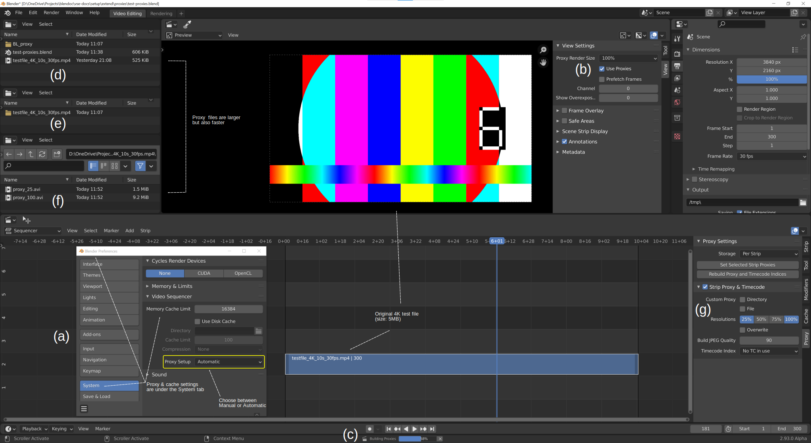
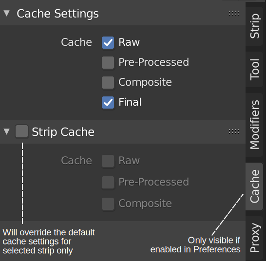

Tweaking performance with proxies & cache
=========================================

Proxies are used to cache images or movies in a file that is easier to playback by reducing the image quality by either decreasing the resolution and/or compressing the image. Nowadays, a 4K video file (3840 × 2160) is no exception. With 30 fps, this can quickly become a burden to your computer's performance. Proxies can only be generated for movie strips! <todo> *Correct???* </todo> The use of proxies is much simplified in Blender 2.93. Let's start with the default Proxy setup.

   Figure 1: Overview of the Proxy building process.

1. First and foremost, proxies are built automatically by default. Whenever you add a strip to the sequencer or you change the Preview Size, the proxies are built automatically in the background. This behavior can be disabled in user preferences.

   To enable or disable the Automatic Proxy Setup, go to the Edit > Preferences menu and select the System tab (see figure 1-a). You can choose between Manual or Automatic. If Automatic is chosen, several things occur after adding a strip to the sequencer or after changing the View Settings of a strip (see figure 1-b).

   A. A small indicator with a percentage shows up in the status bar (see figure 1-c). Depending on your system and the resolution of the clip, this can take a while.
   B. A directory BL_proxy is created as a sub directory of the source folder of the strip (see figure 1-d). Within this directory a sub directory is created with the name of the active strip; e.g. testfile_4K_10s_30fps.mp4 (figure 1-e). And within this folder, the proxy file is created; e.g. proxy_100.avi (figure 1-f).
   C. In the View Settings (see figure 1-b), you can choose which proxy to display. The original video clip (e.g. testfile_4K_10s_30fps.mp4) will then be replaced with the proxy (e.g. proxy_100.avi). If you have selected Proxy Render Size 100% and after that once again Proxy Render Size 25%, there will be two proxy files (see figure 1-f).
   D. Note that the proxy files are quite larger in size (even for 25%) but also faster because they use a more optimized compression format that the original H.264 (MP4) codec.
   E. <todo> *Checkbox Use proxies should/could be checked at all times, even if no proxy is selected. What's the use? Proxy Render Size; scene size and no display: meaning and use case for these two render sizes?* </todo>

.. note::
   You can try it yourself by creating a 4K test movie (see :doc:`test files </setup/organize/dir-structure/creating-test-files>`) and adding it to the sequencer. Check the resolution in the strip sidebar under the source Panel. Without proxies you will notice that scrubbing through strip will stutter. Adding an effect (e.g. Gaussian Blur) will aggravate the problem.

2. If the Proxy Setup in the Preferences panel (see figure 1-a) is set to Manual, then the panel Proxy Settings in the sequencer sidebar (see figure 1-g) come into play. Some of these settings, also influence the Automatic Proxy Setup.

   A. You have to decide if the proxies should be generated Per Strip or globally for the project. If you choose Per Strip, then the Proxy folder (BL_proxy) will be created at the location of the selected strip.  You can override this directory location and name in the panel below with the Custom Proxy Directory checkbox. Or, you can choose Project. The proxy folder BL_proxy will then be created in the directory from the field below. This setting influences also the Automatic setup. The chosen directory will be used for the automatic creation of the BL_proxy directory.

   B. Select the strips (it can be more than one!) for which you want to create proxies. With the button `Set Selected Strip Proxies` you can enable multiple proxy render sizes (25%, 50%, 75%, 100%). With the Overwrite checkbox, you give permission to overwrite existing proxy-files. You'll use this button to enable these settings for *multiple* clips.

   C. You can enable or change these settings also for the selected strip in the Strip Proxy & Timecode panel (see figure 1-g). This works not for multiple selected strips (see above for that). <todo> *Meaning & use case of custom proxy Directory & File* </todo>Here you can also change the  

   .. note::
      The Proxy Render Sizes (25%, 50%, 75% and 100%) refer to a reduction in the resolution of the video file. If the original file is 4K (3840 × 2160), then a proxy file with size 25% will be 1/4 of that resolution or  960 x 540 pixels. Perhaps, it can feel a little strange to have a 100% proxy size. If the file resolution is not changed, how will this help performance? The performance gain comes however with the better compression technique. <todo> *How?* </todo> 

   D. The proxy files however are not yet created. To generate them, you have to click the `Rebuild Proxy and Timecode Indices`. That's why there's also a Automatic mode! The Build indicator (see figure 1-c) appears and the folders and files are created in the background. The check mark next to the Strip Proxy & Timecode panel is checked. Unchecking this box will remove the advantage of smooth previewing but will not delete the proxy file on the hard disk.
   E. The Build JPEG Quality setting 0-100 corresponds to "Lowest Quality" to "Perceptually Lossless" in Blender's H.264 encoding presets. 
   F. <todo>`Timecode index <https://docs.blender.org/manual/en/dev/video_editing/sequencer/sidebar/proxy.html>`_ .</todo>

Cache
-----

   Figure 2: Cache settings.

The biggest impact on playback performance is to allow the Video Sequencer to cache the playback.

<todo> *BUT is it working - seems to have no effect - also the little orange bar of prefetch has disappeared* </todo>

There are two levels of cache, the first is a RAM cache, this is enabled by default but can be increased based on the amount of RAM available.

The next level of cache is a disk cache which stores cached strips on disk. A disk cache can generally cache more than a RAM cache, but it can be slower. Both of these cache options can be configured in the Edit > Preferences menu under the System tab.(see figure 1-a).

The Cache panel in the sidebar will only be visible if the Developer Extras are switched on in the Edit > Preferences menu (Interface tab). It has two panels:

* Cache Settings: these settings apply to all strips in the Project
* Strip Cache: if enabled, these settings apply only to the selected strip; thus overriding the global settings.

<todo> *What do the following options really mean? Any supplemental info?* </todo>
From the manual (https://docs.blender.org/manual/en/dev/video_editing/sequencer/sidebar/cache.html):

* Raw: Cache raw images read from drive, for faster tweaking of strip parameters at the cost of memory usage.
* Pre-processed: Cache preprocessed images, for faster tweaking of effects at the cost of memory usage.
* Composite: Cache intermediate composited images, for faster tweaking of stacked strips at the cost of memory usage.
* Final: Cache final image for each frame.

<todo> *What's the difference between (disk) caching and proxies?* </todo>

Proxies only work with movie strips; cache supports all strip types.
Proxies store result on hard disk; cache store result in RAM (except diskcache)
Proxies cache only the RAW datafile; cache can store intermediate results
Proxies are persistent, cache becomes eventually invalidated
