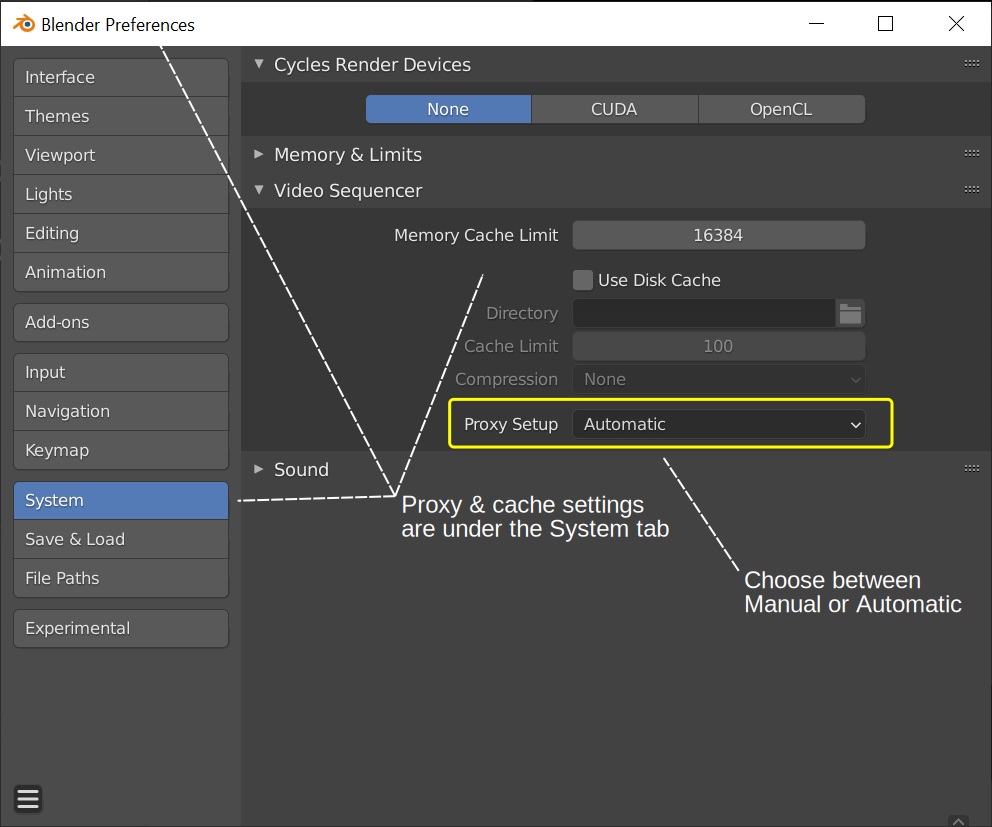
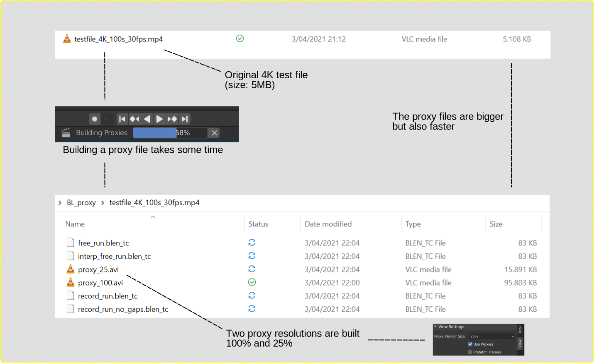

Tweaking performance with proxies & cache
=========================================

Playback performance can be improved through several ways. The biggest impact on performance is to allow the Video Sequencer to cache the playback. There are two levels of cache, the first is a RAM cache, this is enabled by default but can be increased based on the amount of RAM available. The next level of cache is a disk cache which stores cached strips on disk. A disk cache can generally cache more than a RAM cache, but it can be slower. Both of these cache options can be configured in the Preferences.

Another way to improve performance is by using Strip Proxies These are used to cache images or movies in a file that is easier to playback by reducing the image quality by either decreasing the resolution and/or compressing the image. Nowadays, a 4K video file (3840 × 2160) is no exception. With 30 fps, this can be a burden to your computer's performance. 

Proxies
-------
The use of proxies is much simplified in Blender 2.93. First and foremost, proxies are built automatically by default. Whenever you add a strip to the sequencer or you change the Preview Size, the proxies are built automatically in the background. This behavior can be disabled in user preferences.

   Figure 1: Proxy & Cache settings in Preferences.

Let's first disable the Automatic Proxy Building. After adding a 4K video file, you will notice that scrubbing through strip will stutter. Adding an effect (e.g. Gaussian Blur) will aggravate the problem.

.. note::
   You can try it yourself by creating a 4K test file (see :doc:`test files </setup/organize/dir-structure/creating-test-files>`) and adding it to the sequencer.

Now, enable the Automatic Proxy Setup in the Preferences. You'll notice that a small indicator with a percentage shows up in the status bar (see figure 2). At the same time a subdirectory with the name BL_proxy (see figure 2) is created where the original 4K-footage is located.  

   Figure 2: Proxy building.

Remove Full Render size from VSE preview size. Use just 100% instead.
Add Use Proxies checkbox to control whether proxies are used globally
Move preview size to top so it is most prominent
Set default to 100% preview size and use proxies
are heavily changed in Blender version 2.93. 
* Will probably heavily changed in upcoming version?
* Settings: location, %

Cache
-----
