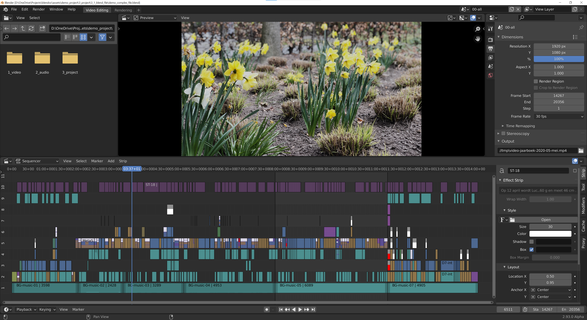

Organize your assets
====================

Even a moderate-sized video project can contain hundreds of assets. It's very easy to get lost in that huge amount of source files. On top of that, you can create additional files during the edit such as subtitles, animations, masks, proxies, and so on. 

.. toctree::
   :maxdepth: 2
 
   dir-structure/creating-directory-structure
   strip-types/striptypes.rst
   dir-structure/creating-test-files.rst

   Figure 1: Example of a complex timeline.

The example in figure 1 takes 14 minutes and contains about 500 strips. As you can see from the coloring, various strip types (movies, text, sound, meta, ...) are used.

A well-thought-out organization is crucial. Certainly, if you are working in a team or for an extended period of time. Without any form of organization or naming conventions, a file named "mask-17" or "IMG-2128" won't ring a bell even after just one week. The only solution then is to open each strip to see what it means. 

   

