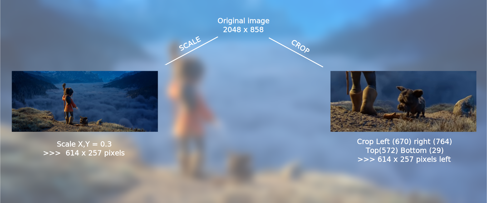
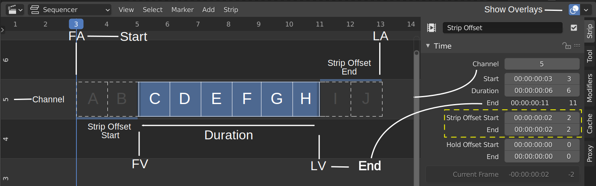
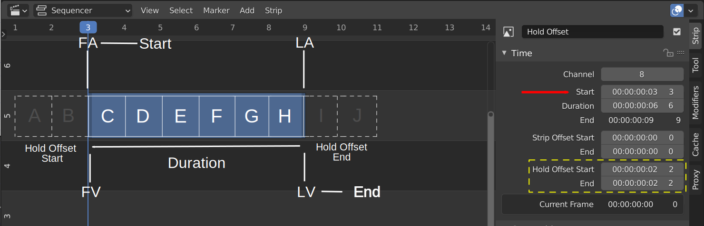
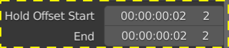
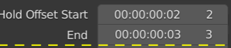
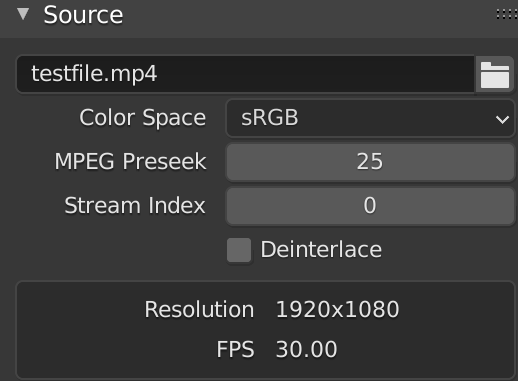
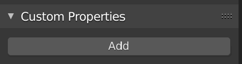

.. _bpy.types.MovieSequence:

***********
Movie Strip
***********

The input source of a movie strip is a video file with extension
``.mp4``, ``.mpg``, ``.mpeg``, ``.dvd``, ``.vob``,  ``.avi``, ``.mov``,
``.dv``, ``.ogg``, ``.ogv``, ``.mkv``, ``.flv``, or ``.webm``
(see `Video formats <https://docs.blender.org/manual/en/dev/files/media/video_formats.html>`_).
Blender uses the ffmpeg library to process the video files.
Which codecs are available depends on the operating system and ffmpeg version.
The :ref:`default <default-color>` color of the movie strip bar is: :movie:`███`

Each video file contains a sequence of image frames (the actual movie)
and some meta-information such as resolution and frame rate (fps).
The resolution info for example is exposed in the source-panel_.
Unfortunately, the source FPS is not.

.. warning::

   The Project Settings parameters should be the same as the strip parameters.
   For example, if the project is set to a frame rate of 30 fps, and your clip is only 24 fps,
   then the clip will appear accelerated.
   A 1 second playback time will contain 30 frames; according to the project settings.
   But, these 30 frames take 1.2 s in the original footage (30 x 24 fps = 1.2 s).
   Compressing 1.2s in 1s during playback will induce acceleration.

   Also, if your clip has variable framerate; e.g. footage from some smartphones,
   then you'll get an audio sync problem because Blender uses a constant frame rate.
   So, you have to convert your clip to a constant frame rate with programs as
   `ffmpeg <https://ffmpeg.org/>`_ or `Handbrake <https://handbrake.fr/>`_

Options
=======

The movie strip is a much-used strip type and has lots of properties.
They are organized in panels in the sidebar.

.. _compositing-panel:

.. admonition:: Compositing Panel

   :menuselection:`--> Sequencer --> Strip --> Sidebar --> Panel --> Compositing`

.. figure:: img/panel-compositing.png
   :scale: 50 %
   :alt: Compositing property
   :align: Right

   Figure 1: Compositing Panel

In the Compositing panel you can set the properties `Blend` and `Opacity` (see figure 1).

Blend
   When two strips are placed on top of each other, e.g. channel 2 on top of channel 1,
   the strip of channel 1 is completely covered by the strip of channel 2 in the Preview;
   as if channel 1 does not exist.
   This is because the Blend Mode of the channel 2 strip is set to *Cross* (default value).
   The Blend mode of a strip on the upper channel specifies how the strip on a lower channel
   should combine or blend with the strip on the upper channel. There are plenty of blend modes,
   such as Replace and Darken but also with less intuitive names such as Color Dodge or Alpha Over.

   .. todo::

      The blend modes and their functional differences are described in detail in section...

Opacity
   The opacity or alpha value of the image is multiplied with this value.
   A value of 1 does not affect the opacity of the strip.
   If the strip is semi-transparent (e.g. alpha=0.6), then it remains semi-transparent.
   A value of zero will make the strip fully transparent because the alpha value of the strips becomes zero.
   See :doc:`Mask strips <mask>` for more details on transparency/opacity.

.. _transform-panel:

.. admonition:: Transform Panel

   :menuselection:`--> Sequencer --> Strip --> Sidebar --> Panel --> Transform`

.. figure:: img/panel-transform.png
   :scale: 50%
   :alt: Transform Property
   :align: Right

   Figure 2: Transform Panel

The Transform panel contains the Position, Scale, and Rotation properties and the -perhaps less- important Mirror property.

.. todo:
   Add a link to the Image Transform menu (Scale to Fit, Scale to Fill, ...).

Position X, Y
   The dimensions of the view area of the sequencer output are set by the project dimensions;
   e.g. 1920 x 1080 by default (see :doc:`../dir-structure/creating-directory-structure`).
   A movie is centered (and scaled) within this view area. With the position X, Y values,
   you can move the frame along the X and Y axis. The values are expressed in pixels.

Scale X, Y
   With this value, you can scale the image on the X and Y axis. It is a number between 0 and infinity.
   A scale of 0.5 on the X axis for example will halve the width of the frame. A scale of 2 will double it.
   To scale the frame proportionally, you have to use the same value for X and Y.

Rotation
   Rotates the frame along the Z axis; expressed in degrees.
   A negative value will rotate counter clockwise. This value can be > 360°, e.g. in animations,
   you can rotate a frame 3 times around its Z axis by entering the value 1080° = 3 x 360°.

Mirror
   Mirrors the image along the X axis (left to right) or the Y axis (top to bottom).

Figure 3 shows an example of a Picture-in-Picture (PIP) setup. There are three channels.
Channel 1 contains the audio. Channels 2 forms the background.
Channel 3 contains the foreground picture. This picture is scaled and repositioned to create a PIP.

.. figure:: img/PIP-example.svg
   :alt: PIP example

   Figure 3: Example of Picture-in-Picture

The "Spring" open-movie in figure 3 has non-default dimensions: 2048 x 858.
To download this movie, see :doc:`creating test-files - section E) </setup/organize/dir-structure/creating-test-files>`.
If you add this movie to the default HD timeline (1920 x 1080), it will be scaled.
The longest dimension (2048) will be scaled to 1920 with a factor of 0.9375 (0.9375 x 2048 = 1920).
The vertical dimension too will be scaled with the same parameter,
given a height of 858 * 0.9375 = 804, leaving two transparent bands above and below the video.
In figure 3 we changed the project dimensions to equal
the strip dimensions so that the viewport is fully taken by the video.

The foreground picture (same open-movie Spring) is scaled with a factor of 0.3.
This leads to the following pixel sizes: 2048 x 0.3 = 614 and 858 x 0.3 = 257.
If you want to position this strip into the top-right corner, you have to change the X and Y position.
But how much? The center of each picture is position (0,0).
So, the background picture runs from bottom-left (-1024,-429) to top-right (1024, 429).
To tuck the small picture in the top-right corner,
you have to move it on the X-axis to position: 1024 - (614/2) = 717.
And on the Y-axis to position 429 - (257/2) = 300.

.. _crop-panel:

.. admonition:: Crop Panel

   :menuselection:`--> Sequencer --> Strip --> Sidebar --> Panel --> Crop`

.. figure:: img/panel-crop.png
   :scale: 50%
   :alt: Crop Property
   :align: Right

   Figure 4: Crop Panel

Cropping is the removal of unwanted outer areas from an image.

Left, Right, Top, Bottom
   The specified number of pixels are removed from the *Left*, *Right*, *Top* and/or *Bottom* of the image.
   And as such making this image smaller. Although you can specify a negative number, this does not affect the image.

Crop and Scale are two very much different operations.
Take a look at figure 5. Both pictures have the same size.
The left one is obtained by scaling to 0.3 of the original 2048 x 858 image,
resulting in a picture of 614 x 257 pixels (see also figure 3).
The picture on the right is obtained by cropping.
The combined crop Left and Right should be equal to 2048 - 614 = 1434.
By cropping 1434 pixels from the left and right, you'll get a resulting picture that is exactly 614 pixels wide.
The combined crop Top and Bottom should be: 858 - 257 = 601. Of course,
the exact ratio between Left/Right and Top/Bottom depends on the detail you want to have in focus.
To center on the dog, we need the following crop sizes: Left (670), Right (734), Top (572), and Bottom (29).
This will result in the exact same size but zoomed in.

   Figure 5: Crop vs Scale example

.. _video-panel:

.. admonition:: Video Panel

   :menuselection:`--> Sequencer --> Strip --> Sidebar --> Panel --> Video`

.. figure:: img/panel-video-strip-movie.png
   :scale: 50%
   :alt: Video Property
   :align: Right

   Figure 6: Video Panel

Strobe
  The Strobe value indicates that only each nth frame will be displayed.
  For example, if you set this to 10, the preview will only display frame 1 for the time-lapse 1-10 frames,
  frame 11 for the time-lapse 11-20, frame 21 for ... It is not really a strobe-effect because the frames 2-9,
  11-19, ... aren't blacked out.  You can easily check this out with the timecode overlay test file
  (see :doc:`Creating test files - section C </setup/organize/dir-structure/creating-test-files>`).

Reverse Frames
   The strip is played backward starting from the last frame in the sequence to the first frame.
   This will also work with split strips. However, just pay attention to use the "Hold Split" (Shift + K) cut.

.. _color-panel:

.. admonition:: Color Panel

   :menuselection:`--> Sequencer --> Strip --> Sidebar --> Panel --> Color`

.. figure:: img/panel-color.png
   :scale: 50%
   :alt: Color Property
   :align: Right

   Figure 7: Color Panel

The properties in this panel seem to be an easy shortcut for some effects or modifiers.
The Saturation could be changed (for each color independent) with the Color Hue modifier.
The Multiply property could be achieved with the Multiply effect and a color strip.

Saturation
   Increases or decreases the color saturation or the vividness of an image.
   A saturation value of zero will turn the color image into a grey-scale image.

Multiply
   Multiplies the colors by this value. This will increases the brightness for values > 1.
   Using a value < 1 will reduce the brightness. A value of zero will produce a uniformly black image;
   the color code of black is RGB (0,0,0).

Convert to Float
   Converts the multiply value to a float data type.

.. todo::

   The Convert to Float does not seem to do anything.
   But see Stackexchange: https://blender.stackexchange.com/questions/57528/

.. _time-panel:

.. admonition:: Time Panel

   :menuselection:`--> Sequencer --> Strip --> Sidebar --> Panel --> Time`

.. figure:: img/panel-time.png
   :scale: 50%
   :alt: Time Property
   :align: Right

   Figure 8: Time Panel

Most - but not all - of the available time codes can be updated in this panel.
A general introduction of the Timeline and time codes can be found in :doc:`Timeline basics </edit/timeline/timeline>`.
A clear understanding of these time codes is essential in trimming and freezing clips.

A movie strip is a sequence of frames that is represented by a blue bar in the sequencer.
To draw this movie strip you need a few properties: the Channel,
the Start position in the timeline and some time codes of the movie strip.

.. |notequal| unicode:: 0x2260

Channel
   Strips are placed in channels; rows stacked upon each other (see for example figure 1 with 3 channels).
   Upon adding a movie clip, Blender searches for the next free channel at the position of the playhead to place the movie strip.
   With this property, you can change the channel number, e.g. the row number of the strip.
   If the channel is already taken by another strip, the strip will be positioned at the next higher available channel.
   The first channel 0 is unusable as a place to put strips.
   This is because it is used by the Sequencer Display to show a composite of all strips above channel 0.
   The maximum number of channels is 32.

To ease the understanding of these timecodes, you can imagine 4 markers on a movie strip.
See figure 9 for some clarification.

- First accessible frame (FA): the first frame in the sequence that *could* be displayed;
  usually also the very first frame of the video.
- First Visible (FV) frame: the first frame that is actually displayed in the preview.
  It marks also the beginning of the strip bar.
- Last Visible (LV) frame: the last frame of the sequence that is displayed. The end of the blue bar.
- Last Accessible (LA) frame: the last frame of the sequence that *could* be displayed.

Start
   This field specifies where the FA frame of the movie strip should be placed on the timeline.
   Upon adding a movie strip to the sequencer, the Start field is set to the value of the playhead.
   You can change it manually by entering a different frame number
   or by moving the strip to another position in the timeline.

   Right after adding FV= FA and LV = LA. Because of this, the movie seems to start at the Start position.
   This is however not always the case.

Duration
   This field represents the actual duration; the length of the blue bar; or LV minus FV (see figure 9).
   You can change the Duration by entering a different value.
   A smaller value will shorten the strip (LV will be positioned earlier; see figure 9);
   a larger value will lengthen the strip by repeating the last frame. LV should become larger than LA?
   So, the Preview window has to display frames that aren't there?
   This problem is solved via two unexposed fields:
   *frame_still_start* and *frame_still_end* fields, accessible through the Python API (see further).

End
   Specifies the actual ending or the Last Visible frame (LV) of the strip.
   This value cannot be edited and is the result of the calculation: Start + Duration - 1.

Strip Offset Start
   With this value, you reposition the FV marker. It can be a positive or negative value.
   If positive, the actual start (FV) of the strip will be further in time.
   A few frames are skipped and the movie strip starts later (see figure 9).
   If negative, the FV frame should come before the FA frame (assuming FV = FA initially), which is impossible.
   As a result, the FA frame will be repeated (see the section on Hold Offset for an explanation).

Strip Offset End
   This field repositions the LV frame. If positive, the strip will be shortened.
   If negative, the strip is lengthened, thereby repeating (freezing) the LA frame.

   Figure 9: Visualization of the Strip Offset fields.

Both Strip Offset fields can be changed by entering a value or by dragging the left or right strip handles.
If Show Overlay is enabled a small bar appears at the bottom or top of the strip bar to indicate the Offsets.

Hold Offset Start
   This field will reposition the FA frame.
   It can't be negative because there are no frames available before the FA frame.
   A positive value does something seemingly contra-intuitive: the Duration of the strip is shortened.
   However, the Start field (where the FA is positioned at the timeline)
   remains the same and there are fewer frames available to display.
   So, the strip is shortened but the FA frame will be different.

Hold Offset End
   This field will reposition the LA frame. A positive number will reduce the LA value.
   The effect is also a shortening of the strip.

   Figure 10: Visualization of the Hold Offset fields.

Of course, you can combine both types of offset. In figure 11, there is a combined offset of 8 frames.
So, the original duration of 10 frames is reduced to two frames.

   Figure 11: Visualization of both Strip and Hold Offset fields.

In the previous text, we mentioned a few times the "freezing" effect or the repeating of the first or last frame.
This can be done by for example extending the LV frame beyond the LA frame
(entering a larger number in the Duration field).
Or by dragging the left or right handle beyond the FA or LA frame.
In figure 12 there is one repeating first frame and two repeating last frames.
The Still Offset fields are added to the Time panel via a Python script.
For an in-depth explanation of how to do this,
see :doc:`section 5 Extra-tools </extra-tools/python/useful-scripts>`.

   Figure 12: Visualization of the Still Offset fields.

Current Frame
   Position of the Playhead relative to the FA frame of the active strip.
   So, if the strip starts at frame 10 and the Playhead is positioned at (timeline) frame 15,
   the Current Frame will be 5.

.. _source-panel:

.. admonition:: Source Panel

   :menuselection:`--> Sequencer --> Strip --> Sidebar --> Panel --> Source`

   Figure 9: Source Panel

File
   The directory and filename that contains the source file.
   When a file has moved this field can be updated instead of re-creating the strip.

Color Space
   To specify the color space of the source file of this strip.
   The color space for the Sequencer is globally set in the Color Management panel
   of the Render Properties but you can deviate from it here.
   Most of the imported clips however have a sRGB color space.
   For :doc:`Scene strip <./scene>` it can be beneficial to set the color space to Filmic.

MPEG Preseek
   Preseek is used to decide for the fastest way to decode a specific frame.
   It should match the Group of Pictures (GOP) size of the video;
   see `Bryan Samis blog <https://aws.amazon.com/blogs/media/part-1-back-to-basics-gops-explained/>`_
   for an in-depth explanation of GOP.
   Finding the GOP-size of a video however, is not a trivial thing (see the above link for a manual approach).
   Setting preseek to a high value like 200 could negatively impact seek performance.
   Therefore it is limited to max = 50 where it makes little to no difference.
   So, in practice, you will not use this option very often.

Stream Index
     Some video files can contain multiple video and audio streams; for example, two surveillance camera outputs.
     However, most video players cannot simultaneously preview both streams next to each other.
     With this property, you can select the stream to preview (but again not both at the same time).
     Of course, you can add the same movie strip twice, set the stream index appropriately,
     and use the Picture-in-Picture approach from above. For the inverse:
     see :doc:`section Extra tools > ffmpeg </extra-tools/ffmpeg/ffmpeg>`
     to merge two video channels into one container.

Deinterlace
   Most (old) TV broadcasts use interlaced scan technology.
   A HD (1920 x 1080) image is split in half (two fields)
   and the odd and even lines are transmitted separately, one after the other.
   So, there is a very small time delay between the two fields.
   Most modern TVs and computer screens work with Progressive technology
   where the full image is transmitted at once; line per line.
   Viewing an interlaced image/movie on a computer monitor
   shows interlacing artifacts such as saw teeth or combing.

   Figure 10 shows an interlaced (left) and deinterlaced (right) still from a movie.
   Perhaps you have to zoom in to see the artifacts. In the movie, the blue square is moving.
   Interlacing artifacts are more noticeable with movement
   because the scanned fields are not taken at the same time (one after the other!).
   And with movement, this becomes more apparent.

.. figure:: img/deinterlace.svg
   :alt: Interlace vs deinterlace
   :align: Right

   Figure 10: Interlaced and deinterlaced scan

You can download the test file from figure 10 from the
`Grass Valley Developers <http://www.gvgdevelopers.com/concrete/products/summit/test_clips/>`_ website.

.. _resolution:

Resolution & fps
   Dimension (width x height in pixels) of the active strip image output.
   Frames per second (fps) of the active strip.
   
   These properties are not not editable and should preferably match the settings of the project (see :doc:`see Organize > Import section </setup/organize/import/import.rst` ).
   
   Note that scaling the strip will change the visual dimension of the frame but of course not its resolution.

.. _custom-panel:

.. admonition:: Custom Properties Panel

   :menuselection:`--> Sequencer --> Strip --> Sidebar --> Panel --> Custom Properties`

   Figure 11: Custom Panel

Custom properties are a way to store your own metadata in a strip.
For example, you could use it to store some copyright
information of a strip or instructions for further post-processing.
More information can be found in the `data-blocks section <https://docs.blender.org/manual/en/dev/files/data_blocks.html#files-data-blocks-custom-properties>`_.
