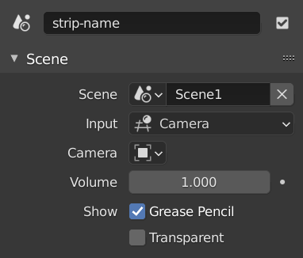

Scene strip
===========

Blender is first and foremost a `3D and 2D modeling <https://docs.blender.org/manual/en/dev/index.html>`_ environment. You can create, animate, and render beautiful realistic or stylized scenes with it. But, instead of rendering out that scene to a video, and then inserting the video file in the sequence editor, you can insert the scene directly. Scene strips are a way to insert the render output of another scene into your sequence. A typical use case is the creation of a 3D logo or an animated intro of your video. 

The :ref:`default <default-color>` color of the scene strip bar is: :scene:`███`. The strip length is determined by the Start & End frame of the imported scene. See the manual to `work with scenes <https://docs.blender.org/manual/en/dev/scene_layout/scene/introduction.html#controls>`_

.. warning::

   Each scene has its own Video Sequencer. Scene strips cannot be used to insert the sequence's own scene. If you have a 3D animation in scene-1, you can insert it as a scene strip in scene-2 but not in scene-1.

.. admonition:: Panels documented elsewhere!

   The following panels are identical to those from the Movie strip: :ref:`Compositing <compositing-panel>`, :ref:`Transform <transform-panel>`, :ref:`Crop <crop-panel>`, :ref:`Video <video-panel>`, :ref:`Color <color-panel>`, :ref:`Time <time-panel>` and :ref:`Custom <custom-panel>`.

A new property is added to the Time panel: ``Original Frame Range``. As the name indicates, this new property shows the number of frames of the original scene held. An entirely new Scene panel is also added.

.. admonition:: Scene Panel

   :menuselection:`--> Sequencer --> Strip --> Sidebar --> Panel --> Scene`

   Figure 1: Scene Property

Scene
   Clicking the icon lets you pick the source scene; e.g. Scene1 from a drop-down. With the link/unlink button (X), you can remove the chosen source scene. The stripbar becomes red as a visual indication.

Input
   You can choose between Camera or Sequencer. The original Scene -where this Scene strip came from- could also have a Video Sequencer with content in it. Therefore, the output of that scene could be generated from that Video Sequencer or from the camera/compositor of that scene. In the original scene, you choose the `Post Processing panel <https://docs.blender.org/manual/en/dev/render/output/properties/post_processing.html?highlight=post%20processing%20panel>`_ of the Output Properties. But, of course, it is not a good habit to change that setting from within another scene. So, with this input choice, you can choose between the two possibilities.

   A nice example is illustrated in figure 2. Suppose that you are responsible for the quarterly reporting. So, each month, you made a nice video and you used a separate scene for that. At the end of the quarter, you want to combine them into an overview video. Figure 2 shows your project file. It contains 5 scenes (see figure 2 at the top). The sequencer of Scene Overview contains four Scene strips; the three months and an intro. From the color, you can deduce that this intro is a text strip. You can see this also in the Preview. Scene Month-2 contains one Movie/Sound strip (blue and green color). Scene Month-3 contains a Text strip (purple) and a color strip (orange). All four scenes have selected the Sequencer as input.
   
   .. figure:: img/scene.svg
      :alt: Scene containing scene strips

      Figure 2: Scene Overview containing four Scene strips

   Although scene strips are a unique feature of Blender against other video editors, there are some major annoyances. First, Blender does not store the editor/workspace you're working in. For the scene Overview, you are obviously working with the Video Editor. For the other scenes, you probably have selected the Modeling Workspace and you're working in the 3D Viewport. If you switch from scene Overview to scene Intro, you stay in the Video Sequencer and you have to switch manually to the other editor. Second, you have no clue where the current frame (you are previewing) is situated in the original scene.
   
   Third, there is also a `Scene Strip Display <https://docs.blender.org/manual/en/dev/video_editing/preview/sidebar.html>`_ panel in the sidebar of the Preview window. These settings can influence the display of your scene strip. For example, if you want to get the compositor output into the scene strip, you have to enable these *four* settings (see also below):
   
   - Properties > Post Processing > Compositor
   - Compositor > Use Nodes > Checked (both in the original scene)
   - View > Scene Strip Display > Rendered
   - Scene Strip > Input > Camera (last two in the target scene)

   Last but not least, the speed of a (complex) scene strip is far from optimal.

Camera
   The same reasoning holds for multiple cameras. The active camera is set in the original scene. But the receiving scene can choose to use another camera. If the original scene has multiple cameras, you can choose here which camera to use. This is very useful in Multicam-editing.

   Following options ``Show Grease Pencil`` and ``Transparent`` only appear if Camera (see above) has been selected.

   Show Grease Pencil
      Shows Grease Pencil in non render preview i.e. Solid mode.

   Transparent
      Creates a transparent background. This is useful for doing overlays like rendering out Grease Pencil films via the Sequencer.

   .. todo::
      These two options don't seem to do much.

Volume
   The volume of the original audio can be increased (> 1) or reduced (< 1) with this setting. See :doc:`Volume level </edit/sound/measuring/volume>` for an interpretation of this volume level.