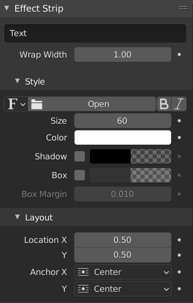

Text strip
==========

The Text strip allows you to directly display text in a frame. It is meant to display titles or other short text fragments. So, its length is limited (511 characters) and 1 line of text (with wrapping). Most properties of the text (e.g. Location, Color, ...) can be animated but not the text content or its font. The :ref:`default <default-color>` color of the Text strip bar is: :text:`███`.

.. figure:: img/text.svg
   :alt: Example of text strip
   
   Figure 1: Example of Text strip

As is obvious from figure 1 that the Text strip is not meant to write essays. Even for credit rolls as in figure 1, things get complicated very quickly. For small texts however it is ideal. With the Location and Anchor fields, you could position the text in the Preview window.

.. admonition:: Panels documented elsewhere!

   The following panels are identical to those from the Movie strip: :ref:`Compositing <compositing-panel>`, :ref:`Transform <transform-panel>`, :ref:`Crop <crop-panel>`, :ref:`Video <video-panel>`, :ref:`Color <color-panel>`, and :ref:`Custom <custom-panel>`.

   The Time panel has no Strip Offset or Hold Offset properties.  because there is no content to offset. The strip is evenly colored. There is also no Source panel because the text is defined in the Effect panel.

An Effect panel is added to the Properties (see figure 2). 

.. admonition:: Effect Strip Panel
   
   :menuselection:`--> Sequencer --> Strip --> Sidebar --> Panel --> Effect Strip`

   Figure 2: Effect Strip Property

Text
   The actual text that is displayed. This text can be 511 characters long. The text can be split over multiple lines with the Wrap feature (see below) but it is not easy to create the split at a predefined location.

Wrap Width
   Wraps the text by a percentage of the frame width. Setting this to zero will disable word wrapping. A value of 1 will wrap the text at the right border of the Preview (there is a slight left and right margin). This option however works in combination with the Anchor and Location fields (see below). The previous effect occurs only with a Center anchor and an X Location of 0.5 (default setting). If a left aligned anchor however is specified, then the X location should be at 0 to have a split at the borders.

Style: Font
   The default font is Blender's own BMonoFont. You could find it in datafiles/fonts folder of your Blender installation. Clicking on the Open button will show a File Browser window with probably the Fonts directory of *your* system selected. This directory is set in the Preferences > File Path > Data. Of course, you can navigate to another folder. There you can choose a new font for the selected Text strip.

   Next to the Font selector, you find the Bold and Italic toggle buttons.  

Style: Size
   Size of the text. The value can vary between 0 and 2000. This size is of course different from the point size of a font (e.g. Arial 12). The default size of 60 corresponds approximately with a point size of 30. 

Style: Color
   Clicking on the color button will display a standard :doc:`Color Picker </edit/color-grading/terminology/terminology>`.

Style: Shadow
   Creates a shadow of the specified color under the text. You can change the color and opacity of the shadow with a color selector next to it. This opens a standard :doc:`Color Picker </edit/color-grading/terminology/terminology>`. You can not change the size nor the orientation of the shadow. In combination with a Box (see below), this gives a really nice effect.

Style: Box
   Creates a background for the text to improve the readability and clarity of text in some situations. The color and opacity of the box can be adjusted using the color selector. 

Style: Box Margin
   The distance the box boundaries extends from the boundaries of the font glyphs. The distance is measured as a factor of the image's width. It is however not obvious how the margin width relates to the width of the text. A value of zero will of course create no margin.

Layout: Location X, Y
   With the values *X* and *Y* you can position the text in the preview frame. The value (0,0) refers to the bottom left and (1,1) to the top right. A value of (0.5, 0.5) sets the anchor of the text in the middle of the frame. Therefore it is good practice to first set the Anchor alignment (see below).

   You can specify a location value > 1; effectively writing the text outside of the Preview frame. Because you can animate this Location value, this comes in very handy to create an effect of rolling in or out. 

Layout: Anchor X, Y
   Horizontal (Left, Center, Right) or vertical (Top, Center, Bottom) anchor point of the text. With this value, you can align the text horizontally or vertically.For example, Location X & Y = 0 and Anchor X = Left and Anchor Y = Bottom, will position the text at the bottom left corner.
