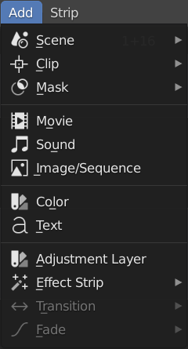

Adding
------

Strip types
...........

.. toctree::
   :maxdepth: 1

   striptypes/text
   striptypes/sound
   striptypes/image
   striptypes/clip
   striptypes/scene
   striptypes/color
   striptypes/mask
   striptypes/movie

.. figure:: /images/vse_setup_project_striptypes_strip-types.svg
   :alt: Available strip types

   Figure 1: Available strip types with color code and properties.

A strip is a sequence of images displayed as a colored horizontal bar.
Each image occupies one frame in the timeline.
In figure 1 the basic strip types are added with the menu :menuselection:`Add` or :kbd:`Shift-A`.
They run from frame 1 up to frame 300.

The strip types are classified into 4 groups:

   1. *Scene, Clip, Mask*: the input source is created in another Blender module
   2. *Movie, Sound, Image/Sequence*: the input source is an external file
   3. *Color, Text*: the input is created within the Sequence Editor
   4. *Adjustment Layer, Effect Strip, Transition, Fade*: the input source is another strip.

Each strip type is uniquely color-coded.
In figure 1, from top to bottom: Scene strip :scene:`███`,
Clip strip :clip:`███`, Mask strip :mask:`███`, Movie strip :movie:`███`,
Sound strip :sound:`███`, Image/Sequence strip :image:`███`,
Color :color:`███` + selected color), and Text :text:`███`.

.. _default-color:

These colors are defined in the User Preferences and can be changed with the menu
:menuselection:`Edit --> Preferences --> Themes --> Video Sequencer`.

The Group 4 strip types are *not* shown in figure 1 and will be discussed in a separate section.
They presume the existence of one or more of the above basic strips.

Each strip has multiple Properties. Figure 1 shows the Properties of a Movie strip at the right hand side.
This sidebar can be displayed with :menuselection:`View --> Sidebar` or shortcut key :kbd:`N`.
All properties are organized in panels, e.g. Compositing, Transform, Crop, ect...
Navigating these panels is explained in `Tabs & panels <https://docs.blender.org/manual/en/dev/interface/window_system/tabs_panels.html>`_.
The top of the sidebar contains the always visible header with the icon of the strip type,
the name of the strip, and a Mute checkbox. You can name or rename your strips here.
If the Mute button is checked the strip will still be visible in the Sequencer but will not produce any output.

Methods
.......

We already discussed the main methods of adding footage to the timeline in :doc:`section Setup > import </setup/organize/import/import>`.

1. Add a strip with the shortcut key (Shift + A) or the Add menu.
2. Drag a video, sound, or image/image sequence on the timeline with the
   `Blender File Browser <https://docs.blender.org/manual/en/dev/editors/file_browser.html>`_.
3. Drag and drop from the File Browser of the operating system.

The most versatile method is adding strips with the shortcut key (:kbd:`Shift  A`) or the Add menu. Only with this method, you can add multiple clips and make use of the import options (e.g. Scale to Fit, ...). However, all three methods are rather limited, compared to some other video editors.

   Figure 1: Add menu

- Using the Add method with multiple clips will place them one after the other on the timeline, starting at the position of the playhead. If you want them stacked however, you have to add the clips one by one.
- When there are already strips at the position of the playhead, Blender will add the strips at the first free channel. You cannot choose which channel, you want the clips to be added.
- The location where you drop the strip is not important. Blender will insert them at the position of the playhead. If, however, you try to drop the strip upon another strip or between strips (hoping that it will insert the strip), nothing will happen. The strip isn't even added.
- There are  32 channels available for inserting strips, although you can scroll to higher-numbered channels. So, in principle, you cannot add more than 32 strips at the same time position. You can however work around this limitation by using meta strips. Select a few strips and right click. Choose "Make meta strip". Shortcut = Ctrl + G. The selected strips collapse into one channel and count also as 1 channel.
- It is not possible to insert strips before or between other strips. You can do that however within the sequencer.
- For the File Browser Drag method, you need to drag the icon of the file. Trying to drag the name will only invoke a select operation.

Some of these limitations are tackled by addons. For example, the `VSE Quick Functions addon <https://github.com/snuq/VSEQF>`_  has the following import additions:
  

- Import At Frame: standard import behavior, places new sequences at the playhead.
- Insert At Frame: the following sequence will be moved forward by the length of the imported sequence.
- Cut And Insert At Frame: all sequences at the current frame will be cut and all following sequences will be moved forward by the length of the imported sequence.
- Import At End: places the imported sequences at the end of the timeline.

There is also a working but experimental version of the Three Point Edit method. With this method, you can load a source clip in a separate preview window (e.g. the Movie Clip Editor), scrub in this clip and set the In (Start) and Out (Finish) points and import this part of the source clip into the timeline with various options (import at frame, insert at frame, ..., see above).