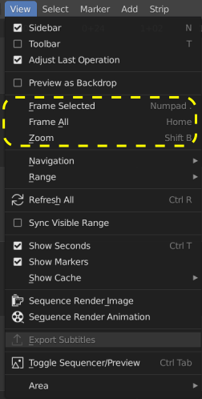
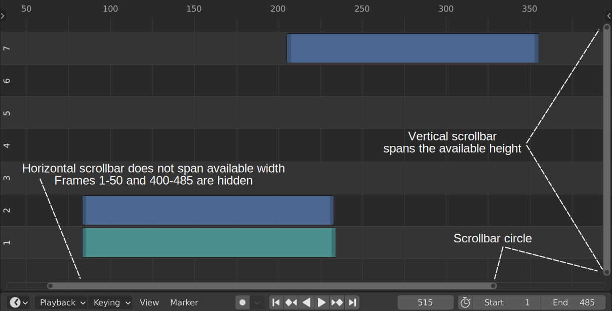

Zoom
----

In a video project it is important that you can zoom in on the section you're working on. On the other hand it's also important to have an overview of your timeline. Zooming in and out is thus a frequent occurring action.

.. raw:: html

   <iframe width="560" height="315" src="https://www.youtube.com/embed/mgmaP45gKqA" title="YouTube video player" frameborder="0" allow="accelerometer; autoplay; clipboard-write; encrypted-media; gyroscope; picture-in-picture" allowfullscreen></iframe>

Figure 1: Annotated video with all the Zoom commands.

.. note::
   As with all commands in Blender, the interpretation of it depends on the position of the mouse cursor. Pressing :kbd:`Home` when the mouse cursor is over the preview window will only zoom the preview window. To zoom in or out of the Sequencer, your mouse cursor must be over that area.

   Figure 2: Menu View

Ctrl-Spacebar
   The :kbd:`Ctrl-Spacebar` key will switch the window under the mouse cursor into full view. The video in figure 1 is created with this view. You can tell because at the very top, there is a button "Back to Previous" |previous-button|. This full-screen view will help you to keep an overview; especially in the vertical dimension (channels).
Home
   Pressing the :kbd:`Home` key zooms in on the total project; from Start to End and from channel 0 to channel 7. If some strips are beyond these borders, the range is extended to cover these strips (see section on :doc:`Moving the Timeline window <../move/move>`. Whenever you get lost in your timeline, press the :kbd:`Home` key to get back at the complete picture. Most Zoom commands can also be issued from the menu (see figure 2). The menu equivalent for :kbd:`Home` is: View > Frame All.

NumpadPeriod
   Pressing the :kbd:`NumpadPeriod` key zooms the timeline to fit only the selected strips. Please note that this key is the period key on the numpad, not the period key on the alphanumeric keypad. The menu equivalent is: View > Frame Selected (see figure 2).

   .. Warning::
      If you don't have a numpad, the `Emulate Numpad <https://docs.blender.org/manual/en/dev/editors/preferences/input.html>`_ option in the User Preferences will not help you out. You cannot use the regular period key from the alphanumeric keypad.

      You can however change these shortcuts or make some of your own. Blender Frenzy has a nice video about creating these `Custom Keymaps <https://www.youtube.com/watch?v=2RtlvZfv8TI>`_.

Numpad +/-
   Pressing the :kbd:`Numpad +` or :kbd:`Numpad -` key will zoom in or out in small incremental steps (+/- 5 frames, +/- 10 frames, +/- 15 frames, ...), starting from the initial. You can continue pressing the key until you have reached the desired zoom level. 

Shift-B
   After pressing the :kbd:`Shift-B` key (from Box Select), a crosshair cursor appears and you can click and drag to draw a rectangle in the Sequencer window. Upon releasing the mouse button, the Sequencer window is zoomed to this rectangle. The menu equivalent of pressing :kbd:`Shift-B` is: View > Zoom (see figure 2).

MMB + Wheel Roll
   Scrolling the middle mouse wheel will zoom in horizontally around the playhead. Scrolling towards yourself will zoom out. Scrolling towards the screen will zoom in.

   Using the MMB wheel roll in combination with Ctrl or Shift will change the behavior from zoom to move (see :doc:`Moving the Timeline window <../move/move>`).

Ctrl-MMB + drag
   Pressing :kbd:`Ctrl-MMB` and dragging left will zoom out or dragging right will zoom in. Dragging up will zoom in vertically and dragging down will zoom out vertically.

   It's important to press the :kbd:`Ctrl-MMB` first and then drag.

Scrollbar circles
   At the bottom and far right of the sequencer area, there are scrollbars. These scrollbars span the whole available width or height if all strips are visible. The length or the height of the scrollbar gives you an indication how much percentage of the Timeline window is visible. Pressing the :kbd:`Home` key for example will make the scrollbars at full length and height.

   Each scrollbar has a circle at the beginning and end (see figure 3). Dragging these circles will shrink or expand the scrollbar length or height and therefore also the Timeline window. For example, in figure 3, dragging the left zoom circle  to the left, will expand the Timeline window from frame 50 to frame 1 (which is the start of the project). The right zoom circle can be dragged up to frame 485 (End of the project). At that moment the scrollbar is full length and cannot be expanded more.

   Figure 3: Vertical and horizontal scrollbars with zoom circles.

Most commands from above will zoom in or out on both dimensions simultaneously. For example, the :kbd:`Home` will zoom until all strips are visible, both on the horizontal and vertical dimension. With the scrollbar circles, you can zoom in or out in one dimension only and choose in which direction you want to zoom.
